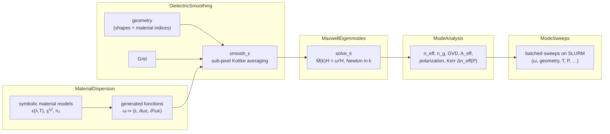

# OptiMode documentation

OptiMode is a differentiable electromagnetic waveguide eigenmode solver, organized as a
monorepo of five composable packages. These pages explain the physics and mathematics
implemented by each component, with usage examples. Function-level reference
documentation lives in docstrings (`?solve_k` etc. in the REPL).

| page | package | contents |
|---|---|---|
| [Material dispersion](material_dispersion.md) | `MaterialDispersion` | symbolic Sellmeier/thermo-optic/χ⁽²⁾/Kerr models, exact symbolic derivatives, generated dispersion functions |
| [Dielectric smoothing](dielectric_smoothing.md) | `DielectricSmoothing` | finite-difference grids, sub-pixel (Kottke) anisotropic smoothing of material interfaces |
| [Maxwell eigenmodes](maxwell_eigenmodes.md) | `MaxwellEigenmodes` | plane-wave Helmholtz operator, `solve_ω²`/`solve_k`, Newton dispersion inversion, adjoint method, GPU & MPB backends |
| [Mode analysis](mode_analysis.md) | `ModeAnalysis` | group index, group-velocity dispersion, effective area, polarization, Kerr (n₂) power corrections |
| [Mode sweeps](mode_sweeps.md) | `ModeSweeps` | asynchronous batched parameter sweeps on SLURM clusters, persistence, gathering |
| [Eigenmode expansion](eigenmode_expansion.md) | `EigenmodeExpansion` | MEOW/SAX-style EME: GDS import + extrusion, cell slicing, interface/propagation S-matrices, cascade; forward/reverse AD; SLURM sweeps |
| [Automatic differentiation](automatic_differentiation.md) | all | how gradients flow end-to-end; Zygote/Mooncake/Enzyme/ForwardDiff interfaces |
| [Python interface](python.md) | `optimode` (PyPI-style package in `python/`) | the same pipeline from Python via JuliaCall |

## The pipeline at a glance

A waveguide mode calculation flows through the packages in dependency order:



Every arrow is differentiable: gradients of any output (e.g. group-velocity dispersion)
with respect to any continuous input (frequency, material parameters, dielectric data)
back-propagate through the entire chain by the adjoint method and ChainRules-based AD;
see [Automatic differentiation](automatic_differentiation.md).

## Units and conventions

OptiMode uses optical-frequency natural units with ``c = 1``:

| quantity | symbol | unit |
|---|---|---|
| length, vacuum wavelength | $x$, $\lambda$ | μm |
| frequency | $\omega = 1/\lambda$ | μm⁻¹ (cycles) |
| propagation constant | $k = n_{\text{eff}}\,\omega = n_{\text{eff}}/\lambda$ | μm⁻¹ (cycles) |
| group index | $n_g = \partial k/\partial\omega$ | — |
| group-velocity dispersion | $\mathrm{GVD} = \partial^2 k/\partial\omega^2$ | μm |
| optical power (Kerr) | $P$ | W |
| Kerr coefficient | $n_2$ | μm²/W |

No factors of $2\pi$ appear: $\omega$, $k$ and the reciprocal-lattice vectors
$\vec{G}$ are all *spatial frequencies in cycles per μm*. To convert the GVD to the
fiber-optics dispersion parameter use
$\beta_2 = \mathrm{GVD}\cdot\lambda^2/(2\pi c^2)$ in SI.

## Quick start

```julia
using OptiMode    # umbrella package: re-exports all five components
using OptiMode.DielectricSmoothing.GeometryPrimitives: Cuboid

# 1. materials → dispersion data at ω = 1/λ
mats  = [Si₃N₄, SiO₂]
f_ε, _ = _f_ε_mats(mats, (:ω,))
ω = 1/1.55
mat_vals = f_ε([ω])

# 2. geometry → smoothed dielectric tensor fields on a grid
grid  = Grid(4.0, 3.0, 128, 96)                       # 4×3 μm cell
core  = MaterialShape(Cuboid([0.,0.], [1.6,0.8], [1. 0.; 0. 1.]), 1)
sm    = smooth_ε((core,), mat_vals, (1,2), grid)      # (3,3,3,Nx,Ny)
ε⁻¹   = sliceinv_3x3(copy(selectdim(sm,3,1)))
∂ε_∂ω = copy(selectdim(sm,3,2))

# 3. eigenmodes at fixed frequency
kmags, evecs = solve_k(ω, ε⁻¹, grid, KrylovKitEigsolve(); nev=2)

# 4. post-processing
neff = kmags[1]/ω
ng   = group_index(kmags[1], evecs[1], ω, ε⁻¹, ∂ε_∂ω, grid)
```

More complete, runnable examples live in [`examples/`](../examples).
