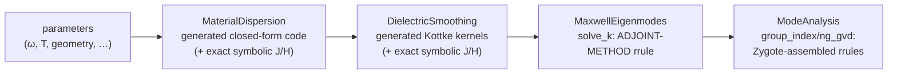

# Automatic differentiation across the pipeline

OptiMode is built so that *any* scalar output of the pipeline — an effective index, a
group index, a GVD value, a Kerr-induced shift — can be differentiated with respect to
*any* continuous input — frequency, temperature, material data, the dielectric field —
efficiently and to solver accuracy. This page explains where the derivatives come from
and how the various AD frameworks hook in.

## Where the hard derivatives live



- **Closed-form stages** (dispersion functions, smoothing kernels) are plain generated
  Julia code: ForwardDiff, Enzyme and Mooncake differentiate them natively, and their
  exact symbolic Jacobians/Hessians (`_fj_ε_mats`, `fj_εₑᵣ`) provide ground truth in
  the test suites.
- **The eigensolve** is where naive AD would fail (you cannot unroll a Krylov
  iteration usefully). `solve_k` therefore carries a hand-written ChainRules `rrule`
  implementing the **adjoint method**: for output cotangents $(\bar k, \bar H)$ it
  computes input cotangents $(\bar\omega, \bar{\varepsilon^{-1}})$ using the
  Hellmann–Feynman theorem plus one iterative *linear* solve (`eig_adjt`) in the
  deflated eigenspace,
  $(\hat M - \omega^2 I)\,\lambda = \bar H - H (H^\dagger \bar H)$.
  Cost: ≈ one extra eigensolve-equivalent, independent of the number of parameters —
  the measured adjoint/primal time ratio is ≈1 (see the main README benchmarks).
- **Post-processing** (`group_index`, FFT/Tullio pipelines) defines its reverse rules
  by running Zygote *once* at rule-construction time and exposing the result as an
  `rrule`, so downstream consumers don't re-trace the FFTs.

## Framework interfaces

| framework | how it connects | notes |
|---|---|---|
| **Zygote** | consumes the ChainRules `rrule`s directly | reference reverse path; whole-pipeline gradients |
| **Mooncake** | per-package `…MooncakeExt` bridges rules with `Mooncake.@from_rrule`; bookkeeping marked `@zero_adjoint` | closed-form stages differentiate natively |
| **Enzyme** | per-package `…EnzymeExt` imports rules with `@import_rrule`; bookkeeping `EnzymeRules.inactive` | imported rules cover *positional* calls only (kwargs lower to `Core.kwcall`) — call `solve_k(ω, ε⁻¹, grid, solver)` positionally |
| **ForwardDiff** | works through the whole smoothing + post-processing stack | FFT support via AbstractFFTs' Dual extension |
| **Reactant/XLA** | `reactant_compile_dispersion` compiles generated dispersion functions | eigensolver pipeline not currently traceable |

## Examples

```julia
using OptiMode, Zygote, FiniteDifferences

solver = KrylovKitEigsolve()
f_neff(om) = solve_k(om, copy(ε⁻¹), grid, solver; nev=1)[1][1] / om

# group index ≡ dk/dω via the adjoint rrule (one extra solve, any backend)
ng_AD = Zygote.gradient(om -> solve_k(om, copy(ε⁻¹), grid, solver)[1][1], ω)[1]

# sensitivity of |k| to every ε⁻¹ tensor entry at every pixel — one adjoint solve
g = Zygote.gradient(ei -> solve_k(ω, ei, grid, solver; k_tol=1e-12)[1][1], copy(ε⁻¹))[1]

# directional check against finite differences
dir = randn(size(ε⁻¹)) .* 1e-3
@assert isapprox(dot(g, dir),
    central_fdm(5,1)(t -> solve_k(ω, ε⁻¹ .+ t.*dir, grid, solver; k_tol=1e-12)[1][1], 0.0);
    rtol=1e-3)

# same gradients with Mooncake / Enzyme via DifferentiationInterface
using DifferentiationInterface, Mooncake, Enzyme
import DifferentiationInterface as DI
DI.derivative(f_neff, AutoMooncake(config=nothing), ω)
DI.derivative(f_neff, AutoEnzyme(mode=Enzyme.Reverse, function_annotation=Enzyme.Const), ω)
```

### Geometry-parameter gradients

With GeometryPrimitives ≥ 0.6 (parametric shape element types, AD-compatible
`surfpt_nearby`/`volfrac`), AD number types flow through shape construction and the
interface queries, so `smooth_ε` is differentiable w.r.t. *geometry* parameters
(widths, thicknesses, sidewall angles, positions), not just material data. The
sensitivity enters where a shape boundary crosses a pixel: the surface point and
normal (`surfpt_nearby`) and the pixel fill fraction (`volfrac`) move with the
parameters, changing the Kottke-smoothed tensor of every interface pixel.

```julia
using OptiMode, ForwardDiff, FiniteDifferences
using OptiMode.DielectricSmoothing.GeometryPrimitives: Polygon, Cuboid
import DifferentiationInterface as DI

# a slab-loaded ridge waveguide parameterized by (w_top, t_core, θ, t_slab)
function ridge_wg(p)
    w_top, t_core, θ, t_slab = p
    # … build Polygon core + Cuboid slab/substrate, vertices/edges depend on p …
    return (core, slab, subs)
end
loss(p) = sum(abs2, smooth_ε(ridge_wg(p), mat_vals, minds, grid))

# forward mode propagates Duals through the whole geometry → smoothing pipeline
g = DI.gradient(loss, AutoForwardDiff(), p0)
@assert g ≈ FiniteDifferences.grad(central_fdm(5,1), loss, p0)[1]  rtol=1e-4
```

Forward mode (ForwardDiff) covers the full geometry→smoothing pipeline. For
*reverse* mode, the per-interface-pixel kernel (shape parameters →
`surfpt_nearby`/`volfrac` → Kottke average) differentiates with **Mooncake**:

```julia
using Mooncake
# one interface pixel held fixed while the shape boundary sweeps across it
kernel_geom(p) = (core = Cuboid(...p...);
    r = GeometryPrimitives.surfpt_nearby(xyz, core);
    rvol = GeometryPrimitives.volfrac((vmin, vmax), last(r), first(r));
    sum(abs2, avg_param(ε₁, ε₂, normcart(vec3D(last(r))), rvol)))
DI.gradient(kernel_geom, AutoMooncake(config=nothing), p0)   # matches finite differences
```

(Enzyme currently segfaults on the StaticArrays matrix inverse inside Cuboid
`surfpt_nearby`, and Zygote receives a non-`SVector` normal in `volfrac`; geometry
reverse mode is therefore Mooncake. Material-data Zygote gradients are unaffected — the
geometry queries are marked `@non_differentiable` for ChainRules, which ForwardDiff and
Mooncake bypass.)

The geometry-AD capability comes from the
[`claude/geometry-gradient-ad-no6zct`](https://github.com/doddgray/GeometryPrimitives.jl/tree/claude/geometry-gradient-ad-no6zct)
branch of `doddgray/GeometryPrimitives.jl` (referenced from each component's
`[sources]`), which gives the shapes a parametric element type and makes the geometric
queries AD-compatible.

### Geometry sensitivities of mode quantities (n_eff, n_g, GVD, fields)

Sensitivities of the *mode solver outputs* — effective index, group index,
group-velocity dispersion, and mode fields — with respect to geometry parameters span
the whole stack:

```text
p (geometry) ──ForwardDiff──▶ ε⁻¹, ∂ωε, ∂²ωε ──Zygote adjoint──▶ n_eff / n_g / GVD / E
```

The geometry → smoothed-dielectric map carries no FFTs and is differentiated in
**forward mode** (ForwardDiff Duals through the parametric shapes and Kottke smoothing).
The expensive eigensolve and post-processing are differentiated in **reverse mode** via
the adjoint-method `rrule`s (`solve_k`, `group_index`). Composing the two by the chain
rule gives the exact geometry gradient — the standard adjoint pattern for waveguide
inverse design, and far cheaper than finite-differencing the full pipeline once the
parameter count grows:

```julia
using OptiMode, ForwardDiff
using OptiMode.ModeAnalysis: Zygote

# geometry p ↦ smoothed dielectric fields (ForwardDiff-friendly; no FFTs)
diel(p) = (sm = smooth_ε(geom(p), mat_vals, (1,2), grid);
           (sliceinv_3x3(copy(selectdim(sm,3,1))), copy(selectdim(sm,3,2))))
ei0, de0 = diel(p0)
N  = length(vec(ei0))
J  = ForwardDiff.jacobian(q -> (d = diel(q); vcat(vec(d[1]), vec(d[2]))), p0)  # forward

# n_eff: reverse-mode adjoint of the eigensolve gives ∂neff/∂ε⁻¹ …
neff_diel(ei) = solve_k(ω, ei, grid, KrylovKitEigsolve(); nev=1)[1][1] / ω
ḡei = Zygote.gradient(neff_diel, copy(ei0))[1]
∇neff = J[1:N, :]' * vec(ḡei)                          # … chained with ∂ε⁻¹/∂p

# n_g: same pattern, but the adjoint also flows through group_index's explicit ε⁻¹/∂ωε args
function ng_diel(ei, de)
    k, ev = solve_k(ω, ei, grid, KrylovKitEigsolve(); nev=1)
    group_index(k[1], ev[1], ω, ei, de, grid)
end
gei, gde = Zygote.gradient(ng_diel, copy(ei0), copy(de0))
∇ng = J[1:N, :]' * vec(gei) .+ J[N+1:2N, :]' * vec(gde)
```

A scalar functional of the mode field (e.g. `sum(abs2, E⃗(...))`) follows the same
recipe. GVD needs one extra step: `ng_gvd`'s hand-rolled adjoint is not itself
reverse-mode differentiable, so the geometry gradient of GVD is taken as the *frequency
derivative* of the (exact AD) geometry gradient of `n_g`, `∇ₚGVD = ∂(∇ₚn_g)/∂ω` — the
high-dimensional geometry sensitivity stays exact AD, only the scalar ω-derivative is
finite-differenced. All four are verified against finite differences of the full
pipeline in `test/runtests.jl` (the `geometry-parameter sensitivities` testset) and
timed in `lib/ModeAnalysis/benchmark/benchmarks.jl`.

## Verification and limitations

Every package's test suite checks gradients against `FiniteDifferences.jl` and, where
available, exact symbolic Jacobians; `lib/*/benchmark/benchmarks.jl` records
gradient/primal cost ratios. Known limitations (also listed in the main README):

- whole-pipeline reverse mode through `smooth_ε`'s per-pixel `mapreduce` is supported
  via Zygote (material data); Mooncake/Enzyme cover the smoothing kernels (compiling
  their reverse rules for the full loop takes impractically long);
- geometry-*parameter* gradients (the `claude/geometry-gradient-ad-no6zct` branch of
  `doddgray/GeometryPrimitives.jl`) work in forward mode (ForwardDiff) through the full
  geometry→smoothing pipeline and in reverse mode (Mooncake) at the per-interface-pixel
  kernel granularity; Enzyme segfaults on the StaticArrays inverse in Cuboid
  `surfpt_nearby` and Zygote hits a non-`SVector` normal in `volfrac`, so those two
  backends are not used for geometry parameters;
- mode-quantity geometry sensitivities (n_eff, n_g, GVD, fields) use the hybrid
  forward-geometry/reverse-adjoint pattern above; GVD additionally needs a scalar
  frequency finite difference because `ng_gvd`'s adjoint is not reverse-differentiable;
- directional FD checks of the `solve_k` adjoint run on a **non-square** test grid;
  this guards the `ε⁻¹_bar` index arithmetic against x/y mix-ups.
