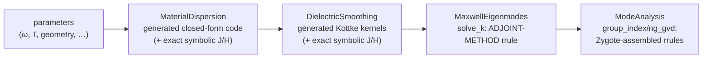

# Automatic differentiation across the pipeline

OptiMode is built so that *any* scalar output of the pipeline — an effective index, a
group index, a GVD value, a Kerr-induced shift — can be differentiated with respect to
*any* continuous input — frequency, temperature, material data, the dielectric field —
efficiently and to solver accuracy. This page explains where the derivatives come from
and how the various AD frameworks hook in.

## Where the hard derivatives live



- **Closed-form stages** (dispersion functions, smoothing kernels) are plain generated
  Julia code: ForwardDiff, Enzyme and Mooncake differentiate them natively, and their
  exact symbolic Jacobians/Hessians (`_fj_ε_mats`, `fj_εₑᵣ`) provide ground truth in
  the test suites.
- **The eigensolve** is where naive AD would fail (you cannot unroll a Krylov
  iteration usefully). `solve_k` therefore carries a hand-written ChainRules `rrule`
  implementing the **adjoint method**: for output cotangents $(\bar k, \bar H)$ it
  computes input cotangents $(\bar\omega, \bar{\varepsilon^{-1}})$ using the
  Hellmann–Feynman theorem plus one iterative *linear* solve (`eig_adjt`) in the
  deflated eigenspace,
  $(\hat M - \omega^2 I)\,\lambda = \bar H - H (H^\dagger \bar H)$.
  Cost: ≈ one extra eigensolve-equivalent, independent of the number of parameters —
  the measured adjoint/primal time ratio is ≈1 (see the main README benchmarks).
- **Post-processing** (`group_index`, FFT/Tullio pipelines) defines its reverse rules
  by running Zygote *once* at rule-construction time and exposing the result as an
  `rrule`, so downstream consumers don't re-trace the FFTs.

## Framework interfaces

| framework | how it connects | notes |
|---|---|---|
| **Zygote** | consumes the ChainRules `rrule`s directly | reference reverse path; the only backend that differentiates the **whole** geometry/material → smoothing → eigensolve → analysis pipeline end-to-end |
| **Mooncake** | per-package `…MooncakeExt` bridges rules with `Mooncake.@from_rrule`; bookkeeping marked `@zero_adjoint` | closed-form stages differentiate natively |
| **Enzyme** | per-package `…EnzymeExt` imports the reverse `rrule`s with `@import_rrule` **and** the forward `frule`s with `@import_frule`; bookkeeping + geometry queries `EnzymeRules.inactive` | forward **and** reverse through the whole stack: Kottke smoothing (material data), `sliceinv_3x3`, `solve_k`, `solve_k_periodic`, `group_index`. Imported rules cover *positional* calls only (kwargs lower to `Core.kwcall`) — call `solve_k(ω, ε⁻¹, grid, solver)` positionally |
| **ForwardDiff** | native Dual propagation through the closed-form stages | covers smoothing (material **and** geometry parameters), `sliceinv_3x3`, and `group_index`; **cannot** trace the FFTW/KrylovKit eigensolve (no Dual method) — forward mode through `solve_k`/`solve_k_periodic` is provided instead by the `frule` bridged to **Enzyme forward** |
| **Reactant/XLA** | `reactant_compile_dispersion` compiles generated dispersion functions | eigensolver pipeline not currently traceable |

### Backend capability matrix

Validated against finite differences (relative error in parentheses for representative
points; see `lib/*/test/runtests.jl` and `examples/ad_backend_benchmarks.jl`):

| stage | ForwardDiff | Zygote (rev) | Mooncake (rev) | Enzyme rev | Enzyme fwd |
|---|---|---|---|---|---|
| `solve_k(ω, ε⁻¹)` | ✗ (no Dual eigensolve) | ✓ (5e-10) | ✓ (5e-10) | ✓ (5e-10) | ✓ frule (5e-10) |
| `solve_k_periodic(ω, ε⁻¹, Λ)` | ✗ | ✓ | ✓ | ✓ (∂Λ 1e-8, ∂ω 4e-11) | ✓ frule |
| `group_index` | ✓ | ✓ | ✓ | ✓ (1e-14) | ✓ frule (1e-14) |
| `sliceinv_3x3` (ε ⇄ ε⁻¹) | ✓ | ✓ | ✓ | ✓ (4e-16) | ✓ (4e-16) |
| `smooth_ε` (Kottke, material data) | ✓ | ✓ (3e-16) | ✓ (3e-16) | ✓ real materials¹ | ✓ real materials¹ |
| **ε field → `sliceinv` → `solve_k` → `group_index`** | ✗ | ✓ | — | ✓ (3e-8) | ✓ frule |
| **full pipeline** (material/geometry → smoothing → eigensolve → analysis) | ✗ | ✓ (2e-10) | ✗ | ε-field onward | ε-field onward |

¹ On Julia 1.11 with Enzyme 0.13.168 (the pinned versions), Enzyme forward & reverse
differentiate `smooth_ε` exactly for every **real material**. They mis-accumulate only the
gradient w.r.t. the *vacuum background* column's frequency-dispersion entries
(`∂ωε`/`∂²ωε`, which are structurally zero and never optimization variables) — an upstream
Enzyme regression (ForwardDiff/Zygote/Mooncake are exact there). This is tracked as a
`@test_broken` in `lib/DielectricSmoothing/test/runtests.jl`. The heterogeneous shape-tuple
index that Enzyme's strict type analysis rejected (`IllegalTypeAnalysisException`) is
isolated in the `EnzymeRules.inactive` helper `_interface_geometry`, so Enzyme compiles and
runs on the preallocated `smooth_ε` assembly. See *Dependency versions* below.

Two complementary forward-mode paths exist: **ForwardDiff** for everything *up to* the
eigensolve (geometry/material → smoothing → `ε⁻¹`), and **Enzyme forward** (via the
`frule`s) *from* the `ε⁻¹` field through the eigensolve and analysis. For a single
end-to-end reverse-mode gradient through the **entire** stack including Kottke smoothing,
use **Zygote**; **Enzyme** is the fast forward/reverse path from the (inverse-)permittivity
field onward.

## Examples

```julia
using OptiMode, Zygote, FiniteDifferences

solver = KrylovKitEigsolve()
f_neff(om) = solve_k(om, copy(ε⁻¹), grid, solver; nev=1)[1][1] / om

# group index ≡ dk/dω via the adjoint rrule (one extra solve, any backend)
ng_AD = Zygote.gradient(om -> solve_k(om, copy(ε⁻¹), grid, solver)[1][1], ω)[1]

# sensitivity of |k| to every ε⁻¹ tensor entry at every pixel — one adjoint solve
g = Zygote.gradient(ei -> solve_k(ω, ei, grid, solver; k_tol=1e-12)[1][1], copy(ε⁻¹))[1]

# directional check against finite differences
dir = randn(size(ε⁻¹)) .* 1e-3
@assert isapprox(dot(g, dir),
    central_fdm(5,1)(t -> solve_k(ω, ε⁻¹ .+ t.*dir, grid, solver; k_tol=1e-12)[1][1], 0.0);
    rtol=1e-3)

# same gradients with Mooncake / Enzyme via DifferentiationInterface
using DifferentiationInterface, Mooncake, Enzyme
import DifferentiationInterface as DI
DI.derivative(f_neff, AutoMooncake(config=nothing), ω)
DI.derivative(f_neff, AutoEnzyme(mode=Enzyme.Reverse, function_annotation=Enzyme.Const), ω)
```

### Geometry-parameter gradients

With GeometryPrimitives ≥ 0.6 (parametric shape element types, AD-compatible
`surfpt_nearby`/`volfrac`), AD number types flow through shape construction and the
interface queries, so `smooth_ε` is differentiable w.r.t. *geometry* parameters
(widths, thicknesses, sidewall angles, positions), not just material data. The
sensitivity enters where a shape boundary crosses a pixel: the surface point and
normal (`surfpt_nearby`) and the pixel fill fraction (`volfrac`) move with the
parameters, changing the Kottke-smoothed tensor of every interface pixel.

```julia
using OptiMode, ForwardDiff, FiniteDifferences
using OptiMode.DielectricSmoothing.GeometryPrimitives: Polygon, Cuboid
import DifferentiationInterface as DI

# a slab-loaded ridge waveguide parameterized by (w_top, t_core, θ, t_slab)
function ridge_wg(p)
    w_top, t_core, θ, t_slab = p
    # … build Polygon core + Cuboid slab/substrate, vertices/edges depend on p …
    return (core, slab, subs)
end
loss(p) = sum(abs2, smooth_ε(ridge_wg(p), mat_vals, minds, grid))

# forward mode propagates Duals through the whole geometry → smoothing pipeline
g = DI.gradient(loss, AutoForwardDiff(), p0)
@assert g ≈ FiniteDifferences.grad(central_fdm(5,1), loss, p0)[1]  rtol=1e-4
```

Forward mode (ForwardDiff) covers the full geometry→smoothing pipeline. For
*reverse* mode, the per-interface-pixel kernel (shape parameters →
`surfpt_nearby`/`volfrac` → Kottke average) differentiates with **Mooncake**:

```julia
using Mooncake
# one interface pixel held fixed while the shape boundary sweeps across it
kernel_geom(p) = (core = Cuboid(...p...);
    r = GeometryPrimitives.surfpt_nearby(xyz, core);
    rvol = GeometryPrimitives.volfrac((vmin, vmax), last(r), first(r));
    sum(abs2, avg_param(ε₁, ε₂, normcart(vec3D(last(r))), rvol)))
DI.gradient(kernel_geom, AutoMooncake(config=nothing), p0)   # matches finite differences
```

(Enzyme currently segfaults on the StaticArrays matrix inverse inside Cuboid
`surfpt_nearby`, and Zygote receives a non-`SVector` normal in `volfrac`; geometry
reverse mode is therefore Mooncake. Material-data Zygote gradients are unaffected — the
geometry queries are marked `@non_differentiable` for ChainRules, which ForwardDiff and
Mooncake bypass.)

The geometry-AD capability comes from
[`doddgray/GeometryPrimitives.jl`](https://github.com/doddgray/GeometryPrimitives.jl)
**v0.6** (`master`, referenced from each component's `[sources]`), which gives the shapes a
parametric element type (`Cuboid{N,N²,T}`, `Polygon{K,K2,T}`) and makes the geometric
queries (`surfpt_nearby`, `volfrac`) accept any `<:Number` — so AD number types flow
through shape construction. This is validated on Julia 1.11: the geometry-parameter
gradient testset passes with ForwardDiff (full pipeline) and Mooncake (per-interface
kernel). **No further GeometryPrimitives changes are needed** for the current AD matrix.

### Geometry sensitivities of mode quantities (n_eff, n_g, GVD, fields)

Sensitivities of the *mode solver outputs* — effective index, group index,
group-velocity dispersion, and mode fields — with respect to geometry parameters span
the whole stack:

```text
p (geometry) ──ForwardDiff──▶ ε⁻¹, ∂ωε, ∂²ωε ──Zygote adjoint──▶ n_eff / n_g / GVD / E
```

The geometry → smoothed-dielectric map carries no FFTs and is differentiated in
**forward mode** (ForwardDiff Duals through the parametric shapes and Kottke smoothing).
The expensive eigensolve and post-processing are differentiated in **reverse mode** via
the adjoint-method `rrule`s (`solve_k`, `group_index`). Composing the two by the chain
rule gives the exact geometry gradient — the standard adjoint pattern for waveguide
inverse design, and far cheaper than finite-differencing the full pipeline once the
parameter count grows:

```julia
using OptiMode, ForwardDiff
using OptiMode.ModeAnalysis: Zygote

# geometry p ↦ smoothed dielectric fields (ForwardDiff-friendly; no FFTs)
diel(p) = (sm = smooth_ε(geom(p), mat_vals, (1,2), grid);
           (sliceinv_3x3(copy(selectdim(sm,3,1))), copy(selectdim(sm,3,2))))
ei0, de0 = diel(p0)
N  = length(vec(ei0))
J  = ForwardDiff.jacobian(q -> (d = diel(q); vcat(vec(d[1]), vec(d[2]))), p0)  # forward

# n_eff: reverse-mode adjoint of the eigensolve gives ∂neff/∂ε⁻¹ …
neff_diel(ei) = solve_k(ω, ei, grid, KrylovKitEigsolve(); nev=1)[1][1] / ω
ḡei = Zygote.gradient(neff_diel, copy(ei0))[1]
∇neff = J[1:N, :]' * vec(ḡei)                          # … chained with ∂ε⁻¹/∂p

# n_g: same pattern, but the adjoint also flows through group_index's explicit ε⁻¹/∂ωε args
function ng_diel(ei, de)
    k, ev = solve_k(ω, ei, grid, KrylovKitEigsolve(); nev=1)
    group_index(k[1], ev[1], ω, ei, de, grid)
end
gei, gde = Zygote.gradient(ng_diel, copy(ei0), copy(de0))
∇ng = J[1:N, :]' * vec(gei) .+ J[N+1:2N, :]' * vec(gde)
```

A scalar functional of the mode field (e.g. `sum(abs2, E⃗(...))`) follows the same
recipe. GVD needs one extra step: `ng_gvd`'s hand-rolled adjoint is not itself
reverse-mode differentiable, so the geometry gradient of GVD is taken as the *frequency
derivative* of the (exact AD) geometry gradient of `n_g`, `∇ₚGVD = ∂(∇ₚn_g)/∂ω` — the
high-dimensional geometry sensitivity stays exact AD, only the scalar ω-derivative is
finite-differenced. All four are verified against finite differences of the full
pipeline in `test/runtests.jl` (the `geometry-parameter sensitivities` testset) and
timed in `lib/ModeAnalysis/benchmark/benchmarks.jl`.

### Material-parameter sensitivities of mode quantities (temperature, crystal orientation)

Temperature `T` and crystal orientation enter only through the dielectric tensor field
`ε(x,y; ω,T,θ)` — `T` through the Sellmeier thermo-optic dispersion, the propagation angle
`θ` through a rotation of the crystal frame.  For a *fixed* mode the modal wavenumber
sensitivity is the exact first-order (Hellmann–Feynman) perturbation built from the
converged field and the same validated `HMH`/`HMₖH` quadratic forms used by `group_index`,

```text
∂k/∂p = ⟨E| ∂ε/∂p |E⟩ / (2⟨ev|∂M̂/∂k|ev⟩)      (fixed ω, frozen mode),
```

so the *only* object that is auto-differentiated is the closed-form material map
`p ↦ ε(p)`, in **forward mode (ForwardDiff)** *or* **reverse mode (Zygote)**.  Unlike the
generic eigensolver reverse rule, this is exact for **any** mode (the quasi-TE00 of an
x-cut LiNbO₃ guide is not the fundamental, since `nₑ < nₒ`) and for the full anisotropic
`∂ε/∂θ` (the rotation introduces off-diagonal Eₓ–E_z coupling).  Representing the modal
functional as a frozen-mode weight `Lw` (so `∂k/∂p = dot(Lw, ∂ε/∂p)`) keeps the eigensolve
out of the differentiated path:

```julia
# Lw built once from the converged mode (pure Float64); then both AD modes agree with FD
∂k(Lw, ω, T, θ; backend) =
    (g(p) = dot(Lw, vec(εfield(ω, p[1], p[2])));
     backend === :forward ? ForwardDiff.gradient(g, [T, θ]) : Zygote.gradient(g, [T, θ])[1])
```

[`examples/tfln_shg_temperature_angle_ad.jl`](../examples/tfln_shg_temperature_angle_ad.jl)
applies this to second-harmonic generation in a 400 nm x-cut TFLN waveguide near
1560 → 780 nm: forward- and reverse-mode AD give the same gradient of the phase-matched
("peak SHG") wavelength with respect to temperature (30–80 °C) and propagation angle
(0–15° from the crystal Y axis) as finite differences of the full quasi-TE00 mode re-solve.
The `test/runtests.jl` testset *"SHG phase-matching sensitivity to temperature & crystal
angle"* checks this agreement.

## Verification and limitations

Every package's test suite checks gradients against `FiniteDifferences.jl` and, where
available, exact symbolic Jacobians; `lib/*/benchmark/benchmarks.jl` records
gradient/primal cost ratios. Known limitations (also listed in the main README):

- `smooth_ε` **material-data** gradients work in every backend, forward and reverse
  (ForwardDiff, Zygote, Mooncake, Enzyme fwd & rev — all to machine precision). The Kottke
  smoothing carries a second-order Taylor jet `J2 = (value, ∂ω, ∂²ω)` through the
  closed-form τ-transforms (`kottke.jl`) to propagate the exact dispersion of the smoothed
  tensor — replacing an earlier symbolically-generated Jacobian/Hessian kernel that was
  slow to compile and could not be compiled by Enzyme at all. The jet is *explicit* dual
  arithmetic (not nested AD), so the smoothing primal stays single-level differentiable.
  Zygote cannot trace the `J2`/`SVector` construction directly, so it consumes a small
  ChainRules `rrule` on the kernel (a ForwardDiff Jacobian); the other backends differentiate
  the jet natively. For Enzyme the geometry queries (`surfpt_nearby`/`volfrac`) are marked
  `EnzymeRules.inactive`, matching the `@non_differentiable` ChainRules markers;
- geometry-*parameter* gradients of `smooth_ε` go through ForwardDiff (forward, full
  pipeline) and Mooncake (reverse, per-interface-pixel); Enzyme and Zygote are not used for
  geometry parameters (Enzyme cannot differentiate the StaticArrays inverse in Cuboid
  `surfpt_nearby`; Zygote hits a non-`SVector` normal in `volfrac`);
- **forward mode through the eigensolve** is provided by hand-written `frule`s
  (`solve_k`, `solve_k_periodic`, `group_index`) bridged to **Enzyme forward** with
  `@import_frule`. ForwardDiff cannot be used there (it has no Dual method for the
  FFTW-planned KrylovKit eigensolve); the `frule` computes the forward tangent from the
  Hellmann–Feynman wavenumber sensitivity plus one deflated linear solve for the
  eigenvector tangent — the forward-mode companion of the adjoint `rrule`;
- the `ε ⇄ ε⁻¹` conversion `sliceinv_3x3` carries closed-form forward/reverse rules
  (`grads/linalg.jl`, exact per-pixel `d(A⁻¹) = −A⁻¹ dA A⁻¹`) bridged to Enzyme, so the
  threaded inversion loop does not block reverse mode;
- geometry-*parameter* gradients (the `claude/geometry-gradient-ad-no6zct` branch of
  `doddgray/GeometryPrimitives.jl`) work in forward mode (ForwardDiff) through the full
  geometry→smoothing pipeline and in reverse mode (Mooncake) at the per-interface-pixel
  kernel granularity; Enzyme segfaults on the StaticArrays inverse in Cuboid
  `surfpt_nearby` and Zygote hits a non-`SVector` normal in `volfrac`, so those two
  backends are not used for geometry parameters;
- mode-quantity geometry sensitivities (n_eff, n_g, GVD, fields) use the hybrid
  forward-geometry/reverse-adjoint pattern above; GVD additionally needs a scalar
  frequency finite difference because `ng_gvd`'s adjoint is not reverse-differentiable;
- directional FD checks of the `solve_k` adjoint run on a **non-square** test grid;
  this guards the `ε⁻¹_bar` index arithmetic against x/y mix-ups.

### Dependency versions

The packages require **Julia ≥ 1.11** and pin the AD stack to **GeometryPrimitives 0.6**
(`doddgray` fork `master`), **Enzyme 0.13**, and **Mooncake 0.4**. The AD matrix above was
re-validated on Julia 1.11.9 with GeometryPrimitives 0.6.0, Enzyme 0.13.168, Mooncake
0.4.203, ForwardDiff 1.4.1, and Zygote 0.7.11. Findings from that upgrade:

- **GeometryPrimitives 0.6 fixes geometry-parameter AD** that failed on the registered
  0.5.0 (whose `Cuboid`/`Polygon` constructors forced `Float64`, raising
  `MethodError: Float64(::ForwardDiff.Dual)`). No fork-side changes are required.
- **Enzyme 0.13.168 needed one package-side change**: the preallocated `smooth_ε` assembly
  indexes a heterogeneous `shapes` tuple, and the newer Enzyme's strict type analysis
  rejected the resulting `Union` (`IllegalTypeAnalysisException`). Isolating that index in
  the `@noinline`, `EnzymeRules.inactive` helper `_interface_geometry` (it is constant
  w.r.t. material data) keeps the `Union` out of Enzyme's type analysis; Enzyme then
  compiles and is exact for every real material (see footnote ¹ for the residual
  vacuum-dispersion entry).
- **Mooncake 0.4.203** and **ForwardDiff/Zygote** are unaffected and exact across the suite.
