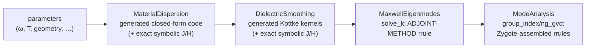

# Automatic differentiation across the pipeline

OptiMode is built so that *any* scalar output of the pipeline — an effective index, a
group index, a GVD value, a Kerr-induced shift — can be differentiated with respect to
*any* continuous input — frequency, temperature, material data, the dielectric field —
efficiently and to solver accuracy. This page explains where the derivatives come from
and how the various AD frameworks hook in.

## Where the hard derivatives live



- **Closed-form stages** (dispersion functions, smoothing kernels) are plain generated
  Julia code: ForwardDiff, Enzyme and Mooncake differentiate them natively, and their
  exact symbolic Jacobians/Hessians (`_fj_ε_mats`, `fj_εₑᵣ`) provide ground truth in
  the test suites.
- **The eigensolve** is where naive AD would fail (you cannot unroll a Krylov
  iteration usefully). `solve_k` therefore carries a hand-written ChainRules `rrule`
  implementing the **adjoint method**: for output cotangents $(\bar k, \bar H)$ it
  computes input cotangents $(\bar\omega, \bar{\varepsilon^{-1}})$ using the
  Hellmann–Feynman theorem plus one iterative *linear* solve (`eig_adjt`) in the
  deflated eigenspace,
  $(\hat M - \omega^2 I)\,\lambda = \bar H - H (H^\dagger \bar H)$.
  Cost: ≈ one extra eigensolve-equivalent, independent of the number of parameters —
  the measured adjoint/primal time ratio is ≈1 (see the main README benchmarks).
- **Post-processing** (`group_index`, FFT/Tullio pipelines) defines its reverse rules
  by running Zygote *once* at rule-construction time and exposing the result as an
  `rrule`, so downstream consumers don't re-trace the FFTs.

## Framework interfaces

| framework | how it connects | notes |
|---|---|---|
| **Zygote** | consumes the ChainRules `rrule`s directly | reference reverse path; whole-pipeline gradients |
| **Mooncake** | per-package `…MooncakeExt` bridges rules with `Mooncake.@from_rrule`; bookkeeping marked `@zero_adjoint` | closed-form stages differentiate natively |
| **Enzyme** | per-package `…EnzymeExt` imports rules with `@import_rrule`; bookkeeping `EnzymeRules.inactive` | imported rules cover *positional* calls only (kwargs lower to `Core.kwcall`) — call `solve_k(ω, ε⁻¹, grid, solver)` positionally |
| **ForwardDiff** | works through the whole smoothing + post-processing stack | FFT support via AbstractFFTs' Dual extension |
| **Reactant/XLA** | `reactant_compile_dispersion` compiles generated dispersion functions | eigensolver pipeline not currently traceable |

## Examples

```julia
using OptiMode, Zygote, FiniteDifferences

solver = KrylovKitEigsolve()
f_neff(om) = solve_k(om, copy(ε⁻¹), grid, solver; nev=1)[1][1] / om

# group index ≡ dk/dω via the adjoint rrule (one extra solve, any backend)
ng_AD = Zygote.gradient(om -> solve_k(om, copy(ε⁻¹), grid, solver)[1][1], ω)[1]

# sensitivity of |k| to every ε⁻¹ tensor entry at every pixel — one adjoint solve
g = Zygote.gradient(ei -> solve_k(ω, ei, grid, solver; k_tol=1e-12)[1][1], copy(ε⁻¹))[1]

# directional check against finite differences
dir = randn(size(ε⁻¹)) .* 1e-3
@assert isapprox(dot(g, dir),
    central_fdm(5,1)(t -> solve_k(ω, ε⁻¹ .+ t.*dir, grid, solver; k_tol=1e-12)[1][1], 0.0);
    rtol=1e-3)

# same gradients with Mooncake / Enzyme via DifferentiationInterface
using DifferentiationInterface, Mooncake, Enzyme
import DifferentiationInterface as DI
DI.derivative(f_neff, AutoMooncake(config=nothing), ω)
DI.derivative(f_neff, AutoEnzyme(mode=Enzyme.Reverse, function_annotation=Enzyme.Const), ω)
```

## Verification and limitations

Every package's test suite checks gradients against `FiniteDifferences.jl` and, where
available, exact symbolic Jacobians; `lib/*/benchmark/benchmarks.jl` records
gradient/primal cost ratios. Known limitations (also listed in the main README):

- whole-pipeline reverse mode through `smooth_ε`'s per-pixel `mapreduce` is supported
  via Zygote; Mooncake/Enzyme cover the smoothing kernels (compiling their reverse
  rules for the full loop takes impractically long);
- geometry-*parameter* gradients are currently finite-difference only —
  GeometryPrimitives ≥ 0.5 hardcodes `Float64` shape fields, so Dual/tangent types
  cannot flow through shape construction;
- directional FD checks of the `solve_k` adjoint run on a **non-square** test grid;
  this guards the `ε⁻¹_bar` index arithmetic against x/y mix-ups.
