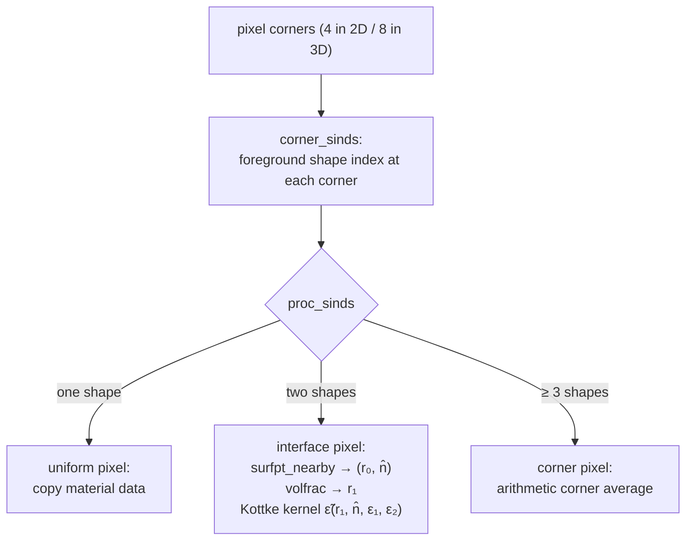

# DielectricSmoothing — grids and sub-pixel interface averaging

`DielectricSmoothing` maps a *geometry* (a list of shapes carrying material data) onto
a finite-difference [`Grid`](../lib/DielectricSmoothing/src/grid.jl) as smoothed
dielectric-tensor fields. Its central algorithm is the anisotropic sub-pixel
("Kottke") smoothing that lets a plane-wave/FFT solver achieve smooth, second-order
convergence — and smooth *derivatives* — despite discontinuous material interfaces.

## The grid

`Grid(Δx, Δy, Nx, Ny)` (2D) or `Grid(Δx, Δy, Δz, Nx, Ny, Nz)` (3D) describes an
origin-centered periodic cell with pixel centers at
$x_i = -\Delta x/2 + (i-1)\,\delta x$, $\delta x = \Delta x / N_x$:

```text
      y ↑   ┌────┬────┬────┬────┐
            │    │    │    │    │      ●  pixel centers  x(g) × y(g)
            ├────●──┼─●────┼────┤      ┼  pixel corners  (corners(g))
            │    │ ████████│    │      ██ a material shape; the shaded pixels
            ├────┼█┼────┼█─┼────┤         straddle its boundary and get
            │    │ ████████│    │         Kottke-averaged tensors
            └────┴────┴────┴────┘  → x
```

Periodicity is inherited from the plane-wave basis of the eigensolver; `g⃗(grid)`
returns the reciprocal-lattice vectors (FFT frequencies, cycles/μm).

## Why naive discretization fails

Sampling $\varepsilon(\vec r)$ pixel-by-pixel ("staircasing") makes computed
eigenvalues converge only first-order in resolution and — worse for optimization —
makes them *discontinuous* functions of geometry parameters: moving a boundary by less
than a pixel changes nothing, then everything at once. Replacing boundary-pixel
tensors with a suitable average restores smooth, accurate convergence. But a scalar
average is provably wrong for vector fields: across a dielectric interface

- the **tangential E-field** $E_\parallel$ is continuous → tensor components acting on
  it should average **arithmetically**;
- the **normal D-field** $D_\perp$ is continuous → components acting on the normal
  E-field should average **harmonically** ($\varepsilon^{-1}$ arithmetically).

## Kottke's tensor averaging

Kottke, Farjadpour & Johnson (Phys. Rev. E **77**, 036611 (2008)) generalize this to
arbitrary anisotropic tensors. Rotate into interface coordinates with
$S = \mathrm{normcart}(\hat n)$ (first axis along the interface normal), then apply
the $\tau$-transform, which re-expresses the constitutive relation in the variables
$(D_\perp, E_\parallel)$ that are continuous across the interface:

$$
\tau(\varepsilon) = \begin{pmatrix}
-1/\varepsilon_{11} & \varepsilon_{12}/\varepsilon_{11} & \varepsilon_{13}/\varepsilon_{11}\\
\varepsilon_{21}/\varepsilon_{11} & \varepsilon_{22}-\tfrac{\varepsilon_{21}\varepsilon_{12}}{\varepsilon_{11}} & \varepsilon_{23}-\tfrac{\varepsilon_{21}\varepsilon_{13}}{\varepsilon_{11}}\\
\varepsilon_{31}/\varepsilon_{11} & \varepsilon_{32}-\tfrac{\varepsilon_{31}\varepsilon_{12}}{\varepsilon_{11}} & \varepsilon_{33}-\tfrac{\varepsilon_{31}\varepsilon_{13}}{\varepsilon_{11}}
\end{pmatrix}.
$$

Because the $\tau$ variables are continuous, a plain volume-weighted average is now
correct, and the smoothed tensor is

$$
\tilde\varepsilon \;=\; S\,\tau^{-1}\!\Big(r_1\,\tau(S^T\varepsilon_1 S)
+ (1-r_1)\,\tau(S^T\varepsilon_2 S)\Big)\,S^T,
$$

where $r_1$ is the volume fraction of material 1 in the pixel (`avg_param`). For a
diagonal $\varepsilon$ and axis-aligned interface this reproduces harmonic averaging of
the normal component and arithmetic averaging of the tangential ones.

### Per-pixel algorithm



### Exact derivative propagation

The pipeline needs not only $\tilde\varepsilon$ but its frequency derivatives. The
smoothing map $\tilde\varepsilon = f(r_1, \varepsilon_1, \varepsilon_2)$ is closed-form
algebra, so the chain rule applies exactly:

$$
\frac{\partial\tilde\varepsilon}{\partial\omega}
= \sum_m \frac{\partial f}{\partial \varepsilon_m}\frac{\partial \varepsilon_m}{\partial\omega},
\qquad
\frac{\partial^2\tilde\varepsilon}{\partial\omega^2}
= \sum_m \frac{\partial f}{\partial \varepsilon_m}\frac{\partial^2 \varepsilon_m}{\partial\omega^2}
+ \sum_{m,n} \frac{\partial^2 f}{\partial \varepsilon_m \partial \varepsilon_n}
  \frac{\partial \varepsilon_m}{\partial\omega}\frac{\partial \varepsilon_n}{\partial\omega}.
$$

The Jacobian ∂f/∂ε and Hessian ∂²f/∂ε² of the Kottke map are generated *symbolically*
once at package load (`fj_εₑᵣ`, `fjh_εₑᵣ`) and fused into the kernels `εₑ_∂ωεₑ` and
`εₑ_∂ωεₑ_∂²ωεₑ`, so `smooth_ε` outputs all three tensor fields
$(\tilde\varepsilon, \partial_\omega\tilde\varepsilon, \partial^2_\omega\tilde\varepsilon)$
in one pass with no numerical differentiation anywhere.

## Scalar fields: `smooth_scalar`

Per-material scalars (e.g. Kerr coefficients $n_2$) are smoothed with the same
shape-classification machinery but a simple volume-fraction average
$\tilde s = r_1 s_1 + (1-r_1) s_2$ — appropriate for quantities that enter
calculations linearly per unit volume.

## Usage

```julia
using MaterialDispersion, DielectricSmoothing
using GeometryPrimitives: Cuboid, Polygon

grid = Grid(6.0, 4.0, 256, 192)

# materials → flat data columns at ω (vacuum appended as background)
mats = [Si₃N₄, SiO₂]
f_ε, _ = _f_ε_mats(mats, (:ω,))
mat_vals = hcat(f_ε([1/1.55]), vcat(vec(Matrix(1.0I,3,3)), zeros(18)))

# shapes carry material indices; first containing shape wins (foreground order)
core = MaterialShape(Cuboid([0.,0.], [1.6,0.8], [1. 0.; 0. 1.]), 1)
shapes, minds = (core,), (1, 2, 3)        # core → SiN, background → SiO₂ here (1,2)

sm  = smooth_ε(shapes, mat_vals, (1,2), grid)   # (3,3,3,Nx,Ny): ε, ∂ωε, ∂²ωε
ε   = copy(selectdim(sm, 3, 1))
ε⁻¹ = MaxwellEigenmodes.sliceinv_3x3(ε)

# Kerr coefficient map for nonlinear solves
n2map = smooth_scalar(shapes, [kerr_n2(m, 1.55) for m in mats], (1,2), grid)
```

### Differentiating w.r.t. geometry

Because the smoothed tensors are continuous, differentiable functions of where each
boundary sits, `smooth_ε` is differentiable w.r.t. *geometry* parameters — not just
material data — when shapes carry an AD-compatible element type (GeometryPrimitives
≥ 0.6). Forward mode propagates through the full pipeline:

```julia
using ForwardDiff
import DifferentiationInterface as DI

geometry(p) = (w, h = p; (MaterialShape(Cuboid([0.,0.], [w,h], [1. 0.; 0. 1.]), 1),))
loss(p) = sum(abs2, smooth_ε(geometry(p), mat_vals, (1,2), grid))
g = DI.gradient(loss, AutoForwardDiff(), [1.6, 0.8])   # ∂loss/∂(w,h)
```

The sensitivity arises in the boundary pixels: as `p` moves a boundary, the surface
point/normal (`surfpt_nearby`) and fill fraction (`volfrac`) of each interface pixel
change, and with them the Kottke-smoothed tensor. See
[Automatic differentiation § Geometry-parameter gradients](automatic_differentiation.md#geometry-parameter-gradients)
for reverse-mode (Mooncake) and backend support.

## Key API

| function | purpose |
|---|---|
| `Grid`, `x`, `y`, `z`, `δx`, `δV`, `x⃗`, `corners`, `g⃗` | grid construction & accessors |
| `MaterialShape`, `material` | attach material data to GeometryPrimitives shapes |
| `smooth_ε`, `smooth_ε_single` | tensor-field smoothing with exact ∂ω, ∂ω² propagation |
| `smooth_scalar`, `smooth_scalar_single` | volume-fraction smoothing of per-material scalars |
| `normcart`, `τ_trans`, `τ⁻¹_trans`, `avg_param`, `avg_param_rot` | Kottke building blocks |
| `εₑ_∂ωεₑ`, `εₑ_∂ωεₑ_∂²ωεₑ` | derivative-propagating smoothing kernels |
| `corner_sinds`, `proc_sinds` | pixel classification |
