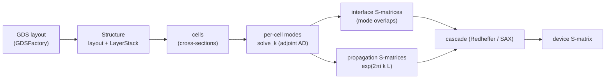

# Eigenmode expansion (EME)

`EigenmodeExpansion` adds a differentiable eigenmode-expansion solver to OptiMode,
following the algorithms of the [MEOW](https://github.com/flaport/meow) and
[SAX](https://github.com/flaport/sax) Python packages but built on OptiMode's
plane-wave mode solver and its adjoint-method gradients.

EME models a *z-varying* waveguide (taper, coupler, grating, …) by (1) slicing it
along the propagation axis into piecewise-z-invariant **cells**, (2) computing the
guided **modes** of each cell's 2D cross-section, and (3) connecting cells with
**scattering matrices** built from modal overlaps and propagation phases. Because
each cell is treated rigorously (full vector modes) and only the *longitudinal*
direction is discretized, EME is efficient for long, slowly-varying devices where
FDTD/FDFD would be expensive.

## From GDS to a 3D structure to cells

The geometry comes from a 2D layout — typically a `.gds` exported by GDSFactory —
plus a vertical **layer stack**. [`read_gds`](#) parses the BOUNDARY polygons
(flatten the layout first so there are no references); [`LayerStack`](#) assigns
each GDS layer a vertical extent `[zmin, zmax]` and a material, and marks it
*patterned* (geometry from the polygons) or *blanket* (a full-width slab such as a
substrate/cladding). [`Structure`](#) ties these together and fixes the simulation
window.

Following MEOW's coordinate convention, light propagates along the layout's
`prop_axis` in-plane direction, and the mode-solver cross-section spans the *other*
in-plane axis (transverse/width) and the vertical (growth) axis. [`build_cells`](#)
divides the propagation range into cells and, at each cell centre, samples the
cross-section: every patterned layer contributes a rectangle per transverse
interval where its polygons cross the cell plane (a scan-line intersection),
extruded over the layer's vertical extent. The resulting shapes are smoothed onto
the grid with `DielectricSmoothing.smooth_ε` (sub-pixel Kottke averaging), giving
the `ε⁻¹` field the eigensolver consumes — so a 3D structure is "extruded" from the
GDS and then divided into cells exactly as in MEOW.

## Modes and the modal inner product

Each cell's cross-section is solved with `MaxwellEigenmodes.solve_k`, yielding
propagation constants `k` (β, cycles/µm; `neff = k/ω`) and transverse-H
eigenvectors. [`mode_fields`](#) reconstructs a *consistent* electromagnetic pair
`E = i ε⁻¹ (k+G)×H`, `H = ℱ[transverse H]` (the convention behind
`MaxwellEigenmodes.S⃗`, so `Re(E*×H)·ẑ` is the power flux).

Modes are coupled through MEOW's modal inner product — the ẑ-component of the
transverse `E₁ × H₂` flux,

$$\langle 1 | 2 \rangle \;=\; \tfrac12 \iint \left(E_{1x} H_{2y} - E_{1y} H_{2x}\right)\,dx\,dy ,$$

implemented by [`inner_product`](#) (with an optional conjugated/Lorentz form).
Each mode is **power-normalized** so `⟨m|m⟩ = 1`, which lets the interface
formulas be used in their simplified `G = I` form.

## Interface and propagation S-matrices

For a step between a left basis (`N_L` modes) and a right basis (`N_R` modes),
[`interface_smatrix`](#) reproduces MEOW's overlap-matrix solve. With overlap
matrices `O_LR[i,j] = ⟨l_i|r_j⟩` and `O_RL[i,j] = ⟨r_i|l_j⟩`,

$$
A_{LR} = O_{LR} + O_{RL}^{\mathsf T},\quad T_{LR} = A_{LR}^{+}\,(2 I_L),\qquad
A_{RL} = O_{RL} + O_{LR}^{\mathsf T},\quad T_{RL} = A_{RL}^{+}\,(2 I_R),
$$

and the reflection blocks are reconstructed from both continuity equations and
averaged,

$$
R_{LL} = \tfrac12\!\left[(O_{RL}^{\mathsf T} T_{LR} - I) + (I - O_{LR} T_{LR})\right],\quad
R_{RR} = \tfrac12\!\left[(O_{LR}^{\mathsf T} T_{RL} - I) + (I - O_{RL} T_{RL})\right],
$$

assembled as `S = [[R_LL, T_RL], [T_LR, R_RR]]` and (optionally) symmetrized for
reciprocity. (`ᵀ → ᴴ` in the conjugated formulation.) Where MEOW uses a
truncated-SVD pseudo-inverse `tsvd_solve`, EigenmodeExpansion uses a
Tikhonov-regularized least-squares solve [`reg_solve`](#) `= (AᴴA + μI)⁻¹AᴴB`,
which approximates the pseudo-inverse with clean forward/reverse AD rules.

Propagation through a cell of length `L` is the diagonal phase matrix
[`propagation_smatrix`](#), `S₂₁ = S₁₂ = diag(exp(2πi·k·L))` (no reflection).

## Cascade

[`cascade`](#) folds the stack `prop₀ ⋆ iface₀₁ ⋆ prop₁ ⋆ … ⋆ prop_{n-1}` with the
Redheffer star product [`star`](#) — the same operation SAX's circuit backend
performs internally — producing the device S-matrix. [`transmission`](#) and
[`reflection`](#) extract the left→right and left-reflection blocks, and
[`power_coupling`](#) gives `|S₂₁[out,in]|²`. [`eme`](#) / [`eme_smatrix`](#) run the
whole pipeline.

## Automatic differentiation

EME inherits OptiMode's AD story. The forward computation is the differentiable
mode solver plus matrix multiplies and linear solves:

- **Reverse mode (Zygote/Mooncake/Enzyme).** Each cell solve carries `solve_k`'s
  adjoint-method `rrule` (one extra linear solve per cell, independent of the
  number of parameters), and the overlap/interface/propagation/cascade algebra
  uses ChainRules-native rules for matmul and `\`. A `Zygote.gradient` of a scalar
  of the device S-matrix (e.g. `power_coupling`) w.r.t. the per-cell `ε⁻¹` fields
  — or frequency — therefore flows end to end. This is the path used for inverse
  design.
- **Forward mode (ForwardDiff).** The geometry → smoothing → dielectric stage
  propagates Duals (widths, gaps, thicknesses, frequency), exactly as documented
  in [automatic_differentiation.md](automatic_differentiation.md); composed with
  the reverse-mode eigensolve adjoint this gives geometry/material sensitivities of
  any modal or device quantity.

Discrete operations — GDS parsing and the polygon scan-line intersection — are
marked non-differentiable (the EME differentiable variables are frequency,
material data and the smoothed dielectric field). `lib/EigenmodeExpansion/test`
checks forward-mode dielectric sensitivities and reverse-mode end-to-end `ε⁻¹`
sensitivities against `FiniteDifferences.jl`.

## SLURM and parameter sweeps

An EME run's cost is dominated by the per-cell mode solves, which map one-to-one
onto `ModeSweeps` tasks (one cross-section per task). With `ModeSweeps` loaded,
[`deploy_eme`](#) deploys all cells of a stack as a SLURM array job (swept over the
cell index and frequency) and [`gather_eme`](#) re-assembles the device S-matrix
from the gathered per-cell fields — reusing the existing batch/sweep/remote-AD
machinery unchanged. See [mode_sweeps.md](mode_sweeps.md) and
[`examples/eme_coupler_setup.jl`](../examples/eme_coupler_setup.jl).

## Example

[`examples/eme_adiabatic_coupler.jl`](../examples/eme_adiabatic_coupler.jl)
generates an adiabatic directional coupler with GDSFactory
([`examples/gen_adiabatic_coupler_gds.py`](../examples/gen_adiabatic_coupler_gds.py)),
exports a GDS, imports it, runs EME at 1550 nm, prints the supermode effective
indices and the bar/cross transmission, and sweeps the coupling over wavelength.
