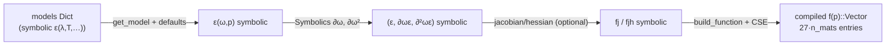

# MaterialDispersion — symbolic material models

`MaterialDispersion` describes optical materials as collections of *symbolic models*
(Symbolics.jl expressions) and turns them into fast numeric functions and **exact**
symbolic derivatives. This is the foundation of OptiMode's differentiability: no
finite differences or interpolation tables enter the dispersion data.

## Physics

### Chromatic dispersion: the Sellmeier model

A transparent dielectric's refractive index is dominated by electronic and phonon
resonances outside its transparency window. Modeling each resonance $i$ as a Lorentz
oscillator far from resonance gives the **Sellmeier equation** for the squared index:

$$
n^2(\lambda) \;=\; A_0 \;+\; \sum_i \frac{B_i\,\lambda^2}{\lambda^2 - C_i},
$$

with $\lambda$ the vacuum wavelength (μm), $B_i$ the oscillator strengths and
$\sqrt{C_i}$ the resonance wavelengths (`n²_sym_fmt1`). The library also provides
Cauchy fits (`n_sym_cauchy`, $n = A + B/\lambda^2 + C/\lambda^4$) and the NASA/CHARMS
thermo-optic Sellmeier form, where strengths and resonance wavelengths are 4th-order
polynomials in temperature:

$$
n^2(\lambda, T) = 1 + \sum_i \frac{S_i(T)\,\lambda^2}{\lambda^2 - \lambda_i^2(T)},
\qquad
S_i(T) = \sum_{j=0}^{4} S_{ij}\,T^j .
$$

Anisotropic (birefringent) crystals such as LiNbO₃ carry one model per principal axis,
assembled into a diagonal **dielectric tensor** $\varepsilon_{ii}(\lambda, T) =
n_i^2(\lambda, T)$; rotated crystal cuts are expressed with
[`rotate`](../lib/MaterialDispersion):

$$
\varepsilon^{\mathrm{rot}} = \mathcal{R}^{T} \varepsilon\, \mathcal{R}, \qquad
\chi^{(2),\mathrm{rot}}_{ijk} =
\mathcal{R}_{ai}\mathcal{R}_{bj}\mathcal{R}_{ck}\, \chi^{(2)}_{abc}.
$$

### Group index and group-velocity dispersion

Because the models are symbolic, frequency derivatives are computed *exactly* by
symbolic differentiation rather than numerically:

$$
n_g = \frac{\partial k}{\partial \omega}\Big|_{\text{bulk}} = n - \lambda\frac{dn}{d\lambda},
\qquad
\mathrm{GVD} = \frac{\partial n_g}{\partial \omega} = \lambda^3\frac{d^2 n}{d\lambda^2},
$$

(`ng_model`, `gvd_model`), and the tensor quantities used by the mode-solver
machinery,

$$
\frac{\partial(\omega\varepsilon)}{\partial\omega} = \varepsilon +
\omega\frac{\partial \varepsilon}{\partial\omega}
\;\;(\texttt{nn̂g\_model}),
\qquad
\frac{\partial^2(\omega\varepsilon)}{\partial\omega^2}\;\;(\texttt{nĝvd\_model}).
$$

### Second-order nonlinearity and Miller's rule

$\chi^{(2)}$ tensors are stored as reference data and scaled to other wavelength
triples with **Miller's rule** — the empirical observation that
$\chi^{(2)}/(\chi^{(1)}_1 \chi^{(1)}_2 \chi^{(1)}_3)$ is nearly frequency-independent:

$$
\chi^{(2)}_{ijk}(\lambda_1,\lambda_2,\lambda_3) \approx \chi^{(2),\mathrm{ref}}_{ijk}
\prod_{p=1}^{3}\frac{\varepsilon_{pp}(\lambda_p)-1}{\varepsilon_{pp}(\lambda_p^{\mathrm{ref}})-1}
\qquad (\texttt{Δₘ}).
$$

### Kerr nonlinearity

Materials may carry an intensity-dependent-index coefficient $n_2$ (μm²/W) under the
`:n₂` model key, constant or wavelength-dependent — see
[Mode analysis § Kerr](mode_analysis.md#kerr-nonlinearity-power-dependent-modes).
Materials without the key are linear: `kerr_n2(mat) == 0`.

## From symbols to fast functions

The mode-solver pipeline consumes, for each material, the triple
$(\varepsilon, \partial_\omega\varepsilon, \partial^2_\omega\varepsilon)$ at a given
frequency. `_f_ε_mats` assembles these symbolically for a whole material list and
compiles one flat function with common-subexpression elimination:



The data layout is *material-major*: material $m$ occupies entries
$27(m-1)+1 \dots 27m$ as `vcat(vec(ε), vec(∂ωε), vec(∂²ωε))`; `ε_views` splits the
flat vector back into 3×3 matrices. `_fj_ε_mats`/`_fjh_ε_mats` append exact symbolic
Jacobians/Hessians w.r.t. the parameter vector — used both for testing AD gradients
against ground truth and for fast sensitivity analysis.

## Usage

```julia
using MaterialDispersion

# library materials and index values
n_SiN  = sqrt(ε_fn(Si₃N₄)(1.55)[1,1])         # 1.996…
ε_LN   = ε_fn(LiNbO₃)(1.55)                   # uniaxial: εxx = εyy ≠ εzz

# generated multi-material dispersion functions (ω and temperature as parameters)
mats = [MgO_LiNbO₃, Si₃N₄, SiO₂]
f, f! = _f_ε_mats(mats, (:ω, :T))
v = f([1/1.55, 35.0])
ε, ∂ωε, ∂²ωε = ε_views(v, length(mats))       # lists of 3×3 views, one per material

# exact group index / GVD models
fng = generate_fn(SiO₂, ng_model(SiO₂), :λ)
fng(1.35)[1,1]                                 # ng(λ=1.35) of SiO₂

# rotated crystal
using Rotations
LN45 = rotate(LiNbO₃, Matrix(RotZ(π/4)); name=:LN_rot45)

# Kerr coefficients (μm²/W); unspecified materials are linear
kerr_n2(Si₃N₄)               # 2.4e-7
kerr_n2(LiNbO₃)              # 0.0
m = with_kerr_n2(SiO₂, 2.0e-8 + 1.0e-8*Symbolics.variable(:λ)^2)  # λ-dependent model
```

## Key API

| function | purpose |
|---|---|
| `Material`, `RotatedMaterial`, `NumMat` | material descriptions |
| `get_model`, `generate_fn` | symbolic model access / function generation |
| `ε_fn`, `ng_model`, `gvd_model`, `nn̂g_model`, `nĝvd_model` | per-material dispersion |
| `_f_ε_mats`, `_fj_ε_mats`, `_fjh_ε_mats`, `ε_views` | multi-material generated functions (+ exact Jacobians/Hessians) |
| `rotate`, `Δₘ`, `χ⁽²⁾_fn` | tensor rotation, Miller scaling, χ⁽²⁾ access |
| `kerr_n2`, `with_kerr_n2`, `set_kerr_n2!` | Kerr (n₂) coefficients |
| `reactant_compile_dispersion` | XLA compilation of generated functions (Reactant ext) |
