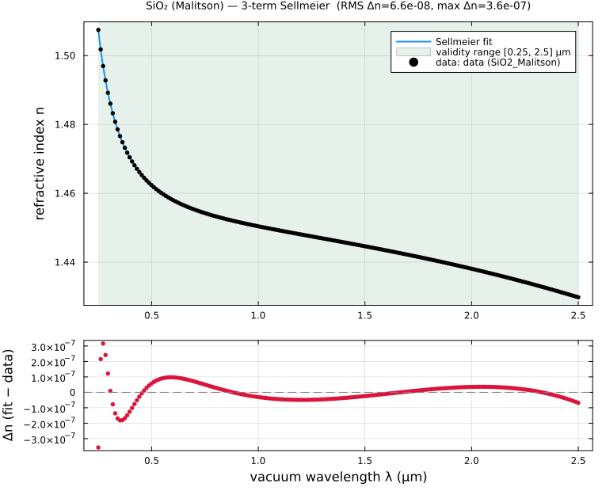
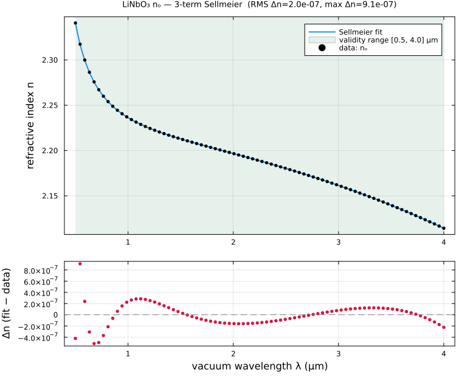
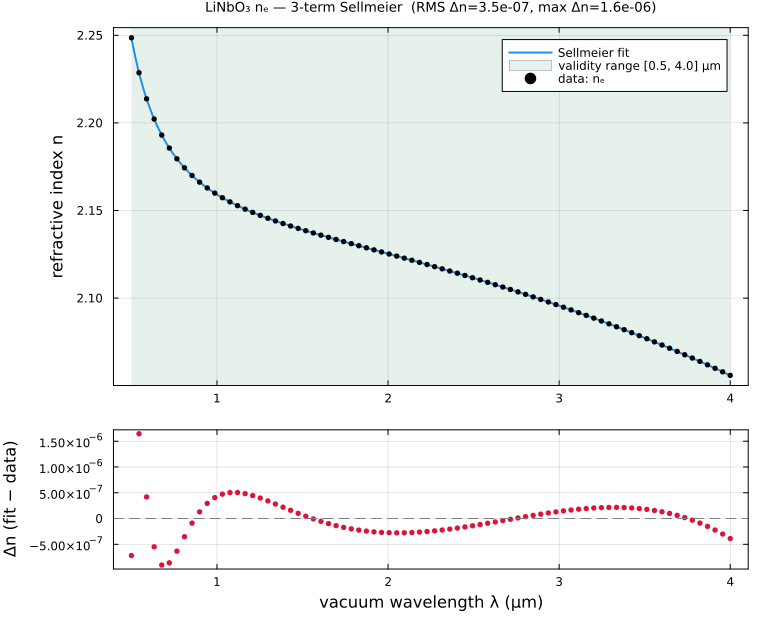
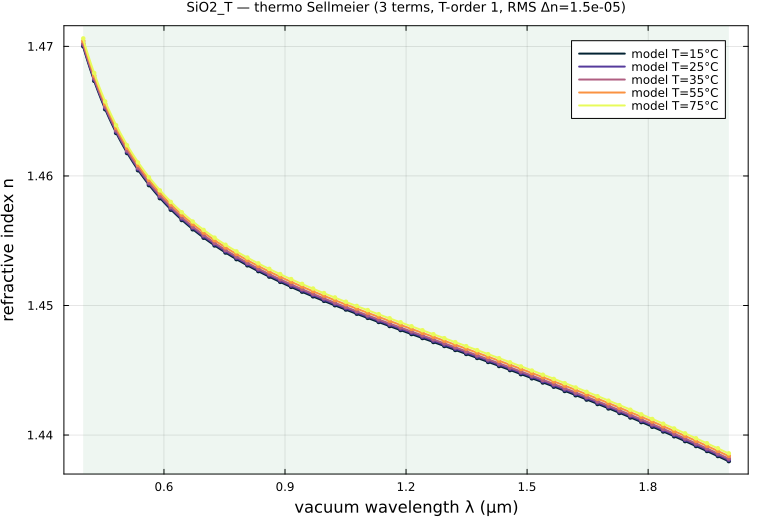

# MaterialFitting — Sellmeier models from published refractive-index data

`MaterialFitting` (in `lib/MaterialFitting`) builds frequency- and temperature-dependent
dielectric `Material` models for the OptiMode suite by fitting **Sellmeier equations** to
published refractive-index data — pulled from [RefractiveIndex.INFO](https://refractiveindex.info)
(by URL) or supplied directly — and turning the fit into a `MaterialDispersion.Material`
ready for the mode solver.

Every step funnels through one representation, the [`IndexDataset`](#datasets) (vacuum
wavelength λ in μm vs. refractive index n), so tabulated data and pre-existing published
fits (Sellmeier / Cauchy / …) are handled uniformly: a published formula is *evaluated*
to samples and then *re-fit* to the desired number of terms and validity range.

```julia
using MaterialFitting, Plots                       # Plots enables the auto-saved fit plots

ds  = refractiveindex_dataset("https://refractiveindex.info/?shelf=main&book=SiO2&page=Malitson";
                              λ_range = (0.25, 2.5))
fit = fit_sellmeier(ds; n_terms = 3, λ_range = (0.25, 2.5), plotdir = "fits")
mat = build_material(fit; name = :SiO₂_fit)         # a MaterialDispersion.Material
```

## Inputs: RefractiveIndex.INFO and your own data

`refractiveindex_dataset(src; …)` accepts

- a **refractiveindex.info page URL**, e.g.
  `https://refractiveindex.info/?shelf=main&book=LiNbO3&page=Zelmon-o` — the `shelf/book/page`
  are mapped to the public database YAML (site and GitHub mirrors, current and legacy layouts
  are tried in turn),
- a **direct `.yml` URL** or a **local YAML file** in RefractiveIndex.INFO format,
- and, via [`index_dataset`](#datasets), **your own `(λ, n)` arrays** or a two-column data file.

RefractiveIndex.INFO records may be *tabulated* `n`/`nk` or one of the *formula* types
(`formula 1`–`9`: Sellmeier, Sellmeier-2, polynomial, Cauchy, …). Tabulated data is used
directly; a formula is evaluated over its validity range. Use `λ_range` to restrict/extend
the sampling and `block=` to pick a specific `DATA` block.

## Fitting a Sellmeier model

[`fit_sellmeier`](@ref) fits

```math
n^2(λ) = A_0 + \sum_{i=1}^{N} \frac{B_i\,λ^2}{λ^2 - C_i}
```

parameterized by the **number of terms** `n_terms` and the **wavelength range of validity**
`λ_range`. A fixed-pole linear least-squares warm start is followed by Levenberg–Marquardt
refinement, and the returned [`SellmeierFit`](@ref) records the coefficients, the validity
range, and the RMS / maximum index error over that range. A pole landing inside the fit
range (a singular model) raises a warning.

**A fit-vs-data comparison plot is saved every time a fit runs** (when `Plots` is loaded
and `plotdir` is given): the fitted `n(λ)` over and beyond the validity range with that
range shaded, plus a residual panel.



```julia
fit = fit_sellmeier(ds; n_terms = 3, λ_range = (0.25, 2.5),
                     name = "SiO₂ (Malitson)", plotdir = "fits")
sellmeier_n(fit, 1.55)        # refractive index at 1.55 μm
build_material(fit)           # → MaterialDispersion.Material (isotropic)
```

## Anisotropic materials — a dataset per axis

Each crystal axis can come from a different RefractiveIndex.INFO entry or user dataset:

```julia
fit_o = fit_sellmeier(ds_o; n_terms = 3, λ_range = (0.5, 4.0))   # ordinary
fit_e = fit_sellmeier(ds_e; n_terms = 3, λ_range = (0.5, 4.0))   # extraordinary
mat   = build_material(; o = fit_o, e = fit_e, name = :LiNbO₃_fit)   # uniaxial
# biaxial:  build_material(; x = fx, y = fy, z = fz)
```

The result has `ε = diagm([n²ₒ, n²ₒ, n²ₑ])` (uniaxial) or `diagm([n²ₓ, n²_y, n²_z])` (biaxial).

| ordinary | extraordinary |
|----------|---------------|
|  |  |

## Temperature-dependent models — data at several temperatures

Given [`IndexDataset`](#datasets)s tagged with temperatures `T` (°C),
[`fit_thermo_sellmeier`](@ref) fits a Sellmeier model at each temperature (warm-started for
coefficient continuity) and then fits every coefficient as a polynomial of order
`T_poly_order` in `(T − T₀)`, giving a full `n²(λ, T)`:

```julia
dsets = [index_dataset(λ, n_at_T; T = T) for (T, n_at_T) in measurements]
tf    = fit_thermo_sellmeier(dsets; n_terms = 3, λ_range = (0.4, 2.0), T_poly_order = 1)
matT  = build_material(tf)                       # ε(λ, T)
generate_fn(matT, :ε, :λ, :T)(1.55, 75.0)        # ε at 1.55 μm, 75 °C
```



## Saving and reloading models

```julia
save_material_model(fit, "SiO2_fit.jld2")        # SellmeierFit or ThermoSellmeierFit
fit2 = load_material_model("SiO2_fit.jld2")
mat  = build_material(fit2)
```

The fit (coefficients, validity range, fit-quality metrics, source dataset) is stored in a
JLD2 file; the symbolic `Material` is rebuilt on demand with [`build_material`](@ref).

## Tests and the worked example

`lib/MaterialFitting/test/runtests.jl` covers Sellmeier fit recovery on synthetic data,
RefractiveIndex.INFO YAML parsing and formula evaluation (a bundled fused-silica record),
anisotropic and temperature-dependent fits, the auto-saved plots, and the save/reload
round-trip; a live RefractiveIndex.INFO fetch is opt-in via
`MATERIALFITTING_TEST_NETWORK=true`. The end-to-end workflow (and the plots above) is
produced by [`examples/material_fitting_sellmeier.jl`](../examples/material_fitting_sellmeier.jl).
