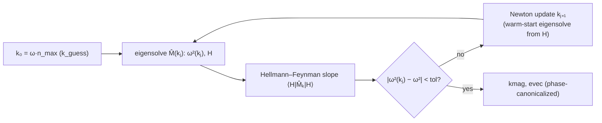

# MaxwellEigenmodes — the plane-wave Helmholtz eigensolver

`MaxwellEigenmodes` finds electromagnetic eigenmodes of dielectric structures from
smoothed dielectric-tensor data, in the plane-wave transverse-polarization formulation
of MPB (Johnson & Joannopoulos, *Opt. Express* **8**, 173 (2001)), and implements the
**adjoint method** that makes the eigensolves differentiable.

## The eigenproblem

For time-harmonic fields $\propto e^{-i\omega t}$ in a source-free, lossless,
non-magnetic dielectric, Maxwell's equations reduce to the curl-curl ("Helmholtz")
eigenproblem for the magnetic field ($c=1$):

$$
\nabla \times \left( \varepsilon^{-1}\, \nabla \times \vec H \right)
\;=\; \omega^2\, \vec H ,
\qquad \nabla\cdot\vec H = 0 .
$$

For a waveguide invariant along $\hat z$ we seek Bloch solutions
$\vec H(\vec r) = e^{i k z} \sum_{\vec G} \vec h_{\vec G}\, e^{i \vec G\cdot\vec r_\perp}$
on the periodic transverse cell, where $\vec G$ runs over the reciprocal lattice of the
[`Grid`](dielectric_smoothing.md). In this basis the curl is algebraic,
$\nabla\times \to i(\vec k + \vec G)\times$, and transversality is enforced *exactly*
by expanding each $\vec h_{\vec G}$ in the two unit vectors
$\hat m_{\vec G}, \hat n_{\vec G} \perp (\vec k + \vec G)$ (`mag_m_n`):

$$
\hat n = \frac{\hat z \times (\vec k+\vec G)}{|\hat z \times (\vec k+\vec G)|},
\qquad
\hat m = \hat n \times \widehat{(\vec k + \vec G)} .
$$

This halves the unknowns (eigenvectors have length $2 N_{xy}$) and removes the
spurious longitudinal nullspace. The operator (`HelmholtzMap`, a matrix-free
`LinearMap`) is then a five-stage pipeline,

$$
\hat M(k) =
\underbrace{\;-[(\vec k+\vec G)\times]^{T}_{c\to t}\;}_{\texttt{kx\_ct}}
\;\mathcal F\;
\underbrace{\varepsilon^{-1}(\vec r)\,\cdot}_{\text{pointwise}}
\;\mathcal F^{-1}
\underbrace{\;[(\vec k+\vec G)\times]_{t\to c}\;}_{\texttt{kx\_tc}},
$$

with planned in-place FFTs ($\mathcal F$) hopping between k-space (where curls are
diagonal) and real space (where $\varepsilon^{-1}$ is diagonal). One application costs
two FFTs — the same structure exploited on GPU. $\hat M$ is Hermitian positive
semidefinite, so iterative eigensolvers (Lanczos/LOBPCG) find the smallest
eigenvalues $\omega^2$ reliably; `solve_ω²(ms, solver)` does exactly this.

## Fixed frequency: `solve_k` and Newton inversion

Eigensolvers compute $\omega^2(k)$, but waveguide problems specify $\omega$ and ask
for $k$. `solve_k` inverts the dispersion relation with a Newton iteration whose
derivative is **free** by the Hellmann–Feynman theorem:

$$
\frac{\partial \omega^2}{\partial k}
= \big\langle H \big| \tfrac{\partial \hat M}{\partial k} \big| H \big\rangle
\;\; (\texttt{HM}_k\texttt{H}),
\qquad
k_{j+1} = k_j - \frac{\omega^2(k_j) - \omega^2}{\partial\omega^2/\partial k|_{k_j}} .
$$



Each Newton step is one warm-started eigensolve; convergence is typically 3–5 steps.
The same quadratic form gives the **group index** directly:
$n_g = \partial k/\partial\omega = 2\omega / \langle H|\hat M_k|H\rangle$ for a
normalized eigenvector (see [Mode analysis](mode_analysis.md)).

## The adjoint method (differentiable eigensolves)

`solve_k` carries a ChainRules `rrule` implementing the adjoint method, so reverse-mode
AD (Zygote, or Mooncake/Enzyme via the bridged rules) can push gradients *through the
eigensolve* at a cost comparable to one extra solve — independent of the number of
parameters. For the eigenpair $(\alpha, \vec x)$ of a Hermitian $\hat A$ with output
cotangents $(\bar\alpha, \bar{\vec x})$:

1. **Eigenvalue path (Hellmann–Feynman).** With $\lambda = (\bar k/\partial_k\omega^2)\,\vec x$, the
   permittivity cotangent accumulates the per-pixel outer product of the D-fields,
   $\bar{\varepsilon^{-1}} \mathrel{+}= -\mathrm{Re}\,(\lambda_d \otimes d^\dagger)$
   (`ε⁻¹_bar`), where $d = \mathcal F\,[(\vec k+\vec G)\times]\vec x$.
2. **Eigenvector path.** When $\bar{\vec x}\neq 0$, solve the (singular but
   consistent) **adjoint linear system** in the deflated subspace,
   $(\hat A - \alpha I)\,\lambda_x = \bar{\vec x} - \vec x\,(\vec x^\dagger \bar{\vec x})$,
   iteratively (`eig_adjt`, preconditioned BiCGStab/`my_linsolve`), then accumulate the
   same outer-product form.
3. **Frequency path.** $\bar\omega = 2\omega(\bar k + \bar k_H)/\partial_k\omega^2$.

The off-diagonal entries of `ε⁻¹_bar` store the symmetrized $(i,j)+(j,i)$ sensitivity
in both slots, matching backpropagation conventions for Hermitian tensor fields
(`herm`/`herm_back`).

## 3D waveguides periodic along $\hat z$: the period derivative

The same plane-wave machinery solves **3D Bloch modes of a waveguide periodic along the
propagation axis** — a Bragg grating or photonic-crystal-defect waveguide — by using a
`Grid{3}` whose $z$-extent is one *absolute spatial period* $\Lambda \equiv$ `grid.Δz`.
The dielectric field $\varepsilon^{-1}$ then describes one period and the reciprocal
lattice acquires $z$-components $g_{j,z} = m_j/\Lambda$ ($m_j\in\mathbb Z$).

`solve_k_periodic(ω, ε⁻¹, Λ, grid, solver)` solves for the Bloch propagation constant
$k_z(\omega)$ and is differentiable with respect to **the period $\Lambda$** in addition
to $\omega$ and $\varepsilon^{-1}$. The key observation is that, with $\varepsilon^{-1}$
held fixed in index space, the Helmholtz operator depends on $\Lambda$ *only* through the
shifted wavevectors $\vec w_j = \vec k - \vec g_j$, whose $z$-components obey

$$
\frac{\partial w_{j,z}}{\partial \Lambda}
= -\frac{\partial g_{j,z}}{\partial \Lambda}
= \frac{g_{j,z}}{\Lambda}.
$$

So $\Lambda$ enters exactly like $k_z$ does — a $\hat z$-shift of every plane wave — but
weighted, plane wave by plane wave, by $g_{j,z}/\Lambda$ instead of uniformly. Every
$k_z$ sensitivity in the adjoint therefore has a period counterpart obtained by this
reweighting:

1. **Eigenvalue channel.** $\partial\omega^2/\partial\Lambda = \langle H|\partial\hat
   M/\partial\Lambda|H\rangle = 2\,\mathtt{HMₖH\_weighted}(H;\,w=g_z/\Lambda)$, the
   Hellmann–Feynman form `HMₖH` with the constant $\hat z\times$ curl replaced by the
   weighted $\tfrac{g_z}{\Lambda}\,\hat z\times$ (`∂ω²_∂Λ`).
2. **Eigenvector channel.** The fixed-$k$ adjoint field $\lambda$ yields a per-plane-wave
   cotangent $\bar{\vec w}_j$ of $\vec w_j$; summing $\bar w_{j,z}$ reproduces the
   $\bar k_H$ term, while summing $\bar w_{j,z}\,g_{j,z}/\Lambda$ gives the period
   contribution $\bar\Lambda_H$ (`_wbar_z`).
3. **Newton inversion (fixed $\omega$).** Combining the two $k_z$ cotangents,
   $\bar\Lambda = \bar\Lambda_H + (\bar k + \bar k_H)\,\partial k_z/\partial\Lambda$ with
   $\partial k_z/\partial\Lambda = -\,(\partial\omega^2/\partial\Lambda)\,/\,(\partial\omega^2/\partial k_z)$.

Both isotropic and anisotropic (including off-diagonal) materials are supported, and the
gradients are validated against finite differences in
`test/periodic_adjoint.jl`; see [`examples/bragg_waveguide_period_adjoint.jl`](../examples/bragg_waveguide_period_adjoint.jl).

## Solver backends

| backend | notes |
|---|---|
| `KrylovKitEigsolve()` | default; matrix-free Krylov–Schur/Lanczos on CPU |
| `DFTK_LOBPCG()`, `IterativeSolversLOBPCG()` | LOBPCG variants |
| `GPUSolver(Float32/Float64; device=:cuda/:cpu)` | device- & precision-generic backend: broadcast kernels + AbstractFFTs plans (FFTW/CUFFT) + KrylovKit, with a device-resident adjoint. Loading `CUDA` activates the GPU path. |
| `MPBSolver()` | runs the eigensolves with Python MPB (`meep.mpb`) via PythonCall; the smoothed tensors are passed as a material function so all backends share one discretization |

All backends are driven through the same `solve_k`/`solve_ω²` interface and the same
solver-generic adjoint rrule.

## Usage

```julia
using DielectricSmoothing, MaxwellEigenmodes

# ε⁻¹: (3,3,Nx,Ny) inverse-permittivity field (e.g. from smooth_ε + sliceinv_3x3)
grid   = Grid(4.0, 3.0, 128, 96)
solver = KrylovKitEigsolve()

kmags, evecs = solve_k(1/1.55, ε⁻¹, grid, solver; nev=2, k_tol=1e-10)
neff = kmags ./ (1/1.55)

# eigenvalue problem at fixed k instead
ω², Hs = solve_ω²(kmags[1], ε⁻¹, grid, solver; nev=2)

# real-space fields
E = E⃗(kmags[1], copy(evecs[1]), ε⁻¹, ∂ε_∂ω, grid; canonicalize=true, normalized=true)

# reverse-mode gradient through the eigensolve (adjoint method)
using Zygote
dk_dω = Zygote.gradient(om -> solve_k(om, ε⁻¹, grid, solver)[1][1], 1/1.55)[1]  # = n_g
g_ε⁻¹ = Zygote.gradient(ei -> solve_k(1/1.55, ei, grid, solver)[1][1], copy(ε⁻¹))[1]

# GPU (with `using CUDA`) and MPB (with `using PythonCall`) backends:
# solve_k(ω, ε⁻¹, grid, GPUSolver(Float32); nev=2)
# solve_k(ω, ε⁻¹, grid, MPBSolver(); nev=2)
```

## Key API

| function | purpose |
|---|---|
| `HelmholtzMap`, `HelmholtzPreconditioner`, `ModeSolver` | matrix-free operator & workspace |
| `solve_ω²`, `solve_k`, `solve_k_single`, `k_guess` | eigensolves & dispersion inversion |
| `solve_k_periodic`, `∂ω²_∂Λ`, `HMₖH_weighted`, `period_weight` | 3D z-periodic (Bragg/PhC) modes & period-Λ adjoint |
| `mag_m_n`, `mag_mn`, `tc`, `ct`, `kx_tc`, `kx_ct` | transverse basis & spectral curls |
| `HMH`, `HMₖH` | operator quadratic forms (ω², ∂ω²/∂k) |
| `E⃗`, `H⃗`, `S⃗`, `canonicalize_phase` | real-space fields |
| `eig_adjt`, `ε⁻¹_bar`, `herm`, `herm_back` | adjoint-method building blocks |
| `sliceinv_3x3`, `_dot`, `_outer`, `flat` | tensor-field linear algebra |
