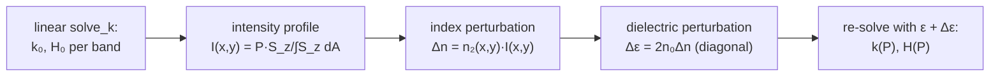

# ModeAnalysis — dispersion, mode character, and Kerr corrections

`ModeAnalysis` post-processes single mode solutions $(k, \vec H)$ from
[`solve_k`](maxwell_eigenmodes.md) into the quantities designers care about — group
index, group-velocity dispersion, effective area, polarization, mode order — and
implements first-order **Kerr (intensity-dependent index) corrections** to mode
solves. All of it is reverse-mode differentiable.

## Group index

The modal group index is the frequency derivative of the propagation constant,
$n_g = \partial k/\partial\omega$. Differentiating the eigenvalue relation
$\langle H|\hat M(k,\omega)|H\rangle = \omega^2$ at fixed eigenvector
(Hellmann–Feynman) gives a closed-form expression evaluated from a *single* mode
solution — no finite differences, no extra solves:

$$
n_g \;=\; \frac{\partial k}{\partial \omega}
\;=\; \frac{2\omega - \big\langle H\big|\tfrac{\partial \hat M}{\partial\omega}\big|H\big\rangle}
        {\big\langle H \big| \tfrac{\partial \hat M}{\partial k} \big| H \big\rangle}
\;=\; \frac{\omega + \tfrac12\langle H|\hat M[\,\varepsilon^{-1}(\partial_\omega\varepsilon)\varepsilon^{-1}\,]|H\rangle}
        {\tfrac12\langle H|\hat M_k|H\rangle},
$$

where the numerator's second term accounts for **material dispersion** through the
smoothed $\partial\varepsilon/\partial\omega$ field
(`group_index(k, evec, ω, ε⁻¹, ∂ε_∂ω, grid)`; the quadratic forms are `HMH` and
`HMₖH`).

## Group-velocity dispersion

The GVD, $\partial n_g/\partial\omega = \partial^2 k/\partial\omega^2$, requires the
*derivative of the eigenvector*, which `ng_gvd`/`ng_gvd_E` obtain by solving one
**adjoint linear system** per mode (same machinery as the `solve_k` pullback,
`eig_adjt`) instead of re-solving at neighboring frequencies. The result uses the
smoothed second-derivative field $\partial^2\varepsilon/\partial\omega^2$ produced by
[`smooth_ε`](dielectric_smoothing.md), and is validated in the test suites against
high-order finite differences of $n_g(\omega)$ through full re-solves. These are the
single-mode group-index and GVD formulas of Gray, West & Ram, *Opt. Express* **32**,
30541 (2024) (Eq. 12 and Supplement 1); for a thin-film lithium niobate waveguide with
realistic anisotropic, dispersive materials they agree with the finite-difference
references to ~8–10 digits (the `modal GVD from a single mode solution` testset in
[`test/runtests.jl`](../test/runtests.jl)).
[`examples/tfln_shg_dispersion.jl`](../examples/tfln_shg_dispersion.jl) reproduces the
forward dispersion calculation behind that paper: it solves the quasi-TE00 modes of an
x-cut TFLN rib at the fundamental and second-harmonic frequencies, computes their group
indices and GVDs, and reports the SHG group-velocity mismatch $|n_{g,2\omega}-n_{g,\omega}|$
(the inverse-design objective), poling period, and quasi-phase-matching bandwidth.

## Geometry-parameter sensitivities

All of the above are differentiable with respect to waveguide *geometry* parameters
(core width/height, sidewall angle, layer thicknesses, positions). Because the geometry
enters only through the smoothed dielectric fields, the gradient factors as a
forward-mode Jacobian of the geometry→dielectric map (ForwardDiff Duals through the
parametric shapes and Kottke smoothing) composed with the reverse-mode adjoint of the
eigensolve/post-processing (`solve_k`, `group_index`):

$$
\frac{\mathrm{d}\,q}{\mathrm{d}\,p_i}
= \Big\langle \frac{\partial q}{\partial \varepsilon^{-1}},\ \frac{\partial \varepsilon^{-1}}{\partial p_i}\Big\rangle
+ \Big\langle \frac{\partial q}{\partial(\partial_\omega\varepsilon)},\ \frac{\partial(\partial_\omega\varepsilon)}{\partial p_i}\Big\rangle,
\qquad q \in \{n_\text{eff},\ n_g,\ \textstyle\int|E|^2,\ \dots\}.
$$

This is the standard adjoint pattern for waveguide inverse design. GVD's geometry
gradient is obtained as the frequency derivative of the (exact AD) $n_g$ geometry
gradient. See [Automatic differentiation § Geometry sensitivities of mode
quantities](automatic_differentiation.md#geometry-sensitivities-of-mode-quantities-n_eff-n_g-gvd-fields)
for runnable code; the `geometry-parameter sensitivities` testset in `test/runtests.jl`
validates $n_\text{eff}$, $n_g$, GVD and a field functional against finite differences.

## Mode character

- `E_relpower_xyz(ε, E)`: relative E-field power along x/y/z — distinguishes
  quasi-TE (`(0.95, 0.04, 0.01)`-like) from quasi-TM modes.
- `count_E_nodes(E, ε, pol_idx)`: counts sign changes of the dominant field component
  along x and y cuts → Hermite–Gauss-like mode order $(m, n)$.
- `mode_viable` / `mode_idx`: filter mode lists for a target polarization and order —
  robust mode tracking through crossings in parameter sweeps.
- `𝓐(n, ng, E)`: effective area from the energy-normalized field.

### Hermite–Gaussian fit classifier (`hg_mode_label`)

`hg_mode_label(E, grid; max_order)` is an alternative, threshold-free labeling scheme.
Instead of counting nodes it models the dominant transverse field as a single elliptical
Hermite–Gaussian

$$
\psi_{mn}(x,y) = H_m\!\Big(\tfrac{\sqrt2\,(x-x_0)}{w_x}\Big)\,
                 H_n\!\Big(\tfrac{\sqrt2\,(y-y_0)}{w_y}\Big)\,
                 \exp\!\Big[-\tfrac{(x-x_0)^2}{w_x^2}-\tfrac{(y-y_0)^2}{w_y^2}\Big],
$$

and, for every order $(m,n)$ up to `max_order` and both transverse polarizations
($x\!\to$ TE, $y\!\to$ TM), optimizes the four shape parameters $(x_0,y_0,w_x,w_y)$ to
minimize the squared error against the mode field (the amplitude is eliminated by linear
projection; the shape is seeded at the field's intensity centroid with matched transverse
variances). The mode is labeled by the polarization/order of the lowest-residual fit:

```julia
using ModeAnalysis: hg_mode_label
E   = E⃗(k, copy(ev), ε⁻¹, ∂ε_∂ω, grid; canonicalize=true, normalized=true)
lbl = hg_mode_label(E, grid; max_order=4)
lbl.label      # e.g. "TE₂₀"
lbl.pol, lbl.m, lbl.n   # (:TE, 2, 0)
lbl.rel_error  # normalized squared misfit ∈ [0,1] — a quantitative goodness-of-fit
lbl.te_frac    # fraction of transverse power in Ex (TE-ness)
```

Unlike node counting it needs no amplitude threshold, returns a continuous fit-quality
metric, and discriminates polarization by penalizing cross-polarized power. On Si₃N₄- and
x-cut-LiNbO₃-core multimode waveguides it reproduces the (node-count ÷ 2) labels of the
original classifier on every guided mode while adding `rel_error`/`te_frac`; see the
`Hermite–Gaussian mode labeling` testset in `test/runtests.jl` and
[`examples/hermite_gaussian_mode_labeling.jl`](../examples/hermite_gaussian_mode_labeling.jl).
(`count_E_nodes` returns Σ|Δ sign|, i.e. *twice* the Hermite–Gaussian order, since each
zero crossing flips the field sign.)

## Kerr nonlinearity: power-dependent modes

With per-material Kerr coefficients $n_2$ (μm²/W, from
`MaterialDispersion.kerr_n2`, mapped onto the grid by
`DielectricSmoothing.smooth_scalar`), `solve_k_kerr` computes first-order
power-corrected modes:



1. **Intensity.** The mode's longitudinal Poynting flux
   $S_z = \mathrm{Re}(\vec E \times \vec H^*)\cdot\hat z$ (`poynting_z`) is normalized
   to carry the specified total power $P$ (W):
   $I(x,y) = P\, S_z / \int S_z\, dA$, so $\int I\, dA = P$ (`mode_intensity`).
   Each band is corrected assuming the *full* power resides in that mode (no cross
   coupling).
2. **Perturbation.** $\Delta n = n_2 I$ and, to first order in $\Delta n/n_0$,
   $\Delta\varepsilon_{aa} = 2 n_0 \Delta n$ with $n_0 = \sqrt{\mathrm{tr}\,\varepsilon/3}$
   per pixel (`kerr_dielectric_perturbation`).
3. **Re-solve.** Band $b$ is re-solved with $\varepsilon + \Delta\varepsilon$; the
   power-dependent effective-index shift is
   $\Delta n_{\mathrm{eff}}(P) = (k_b(P) - k_b(0))/\omega$.

For a single mode this reproduces the textbook self-phase-modulation result

$$
\Delta n_{\mathrm{eff}} \;\approx\; \frac{n_2\,P}{A_{\mathrm{eff}}},
\qquad
A_{\mathrm{eff}} = \frac{\big(\int I\, dA\big)^2}{\int I^2\, dA},
\qquad
\gamma = \frac{2\pi\, n_2}{\lambda\, A_{\mathrm{eff}}},
$$

verified to a few percent for a Si₃N₄ waveguide in the test suite and in
[`examples/kerr_si3n4_waveguide.jl`](../examples/kerr_si3n4_waveguide.jl)
(γ ≈ 0.95 W⁻¹m⁻¹ for a 1.60 × 0.80 μm core at 1.55 μm, matching literature values).

## Forced grid convergence

A waveguide effective index computed on a *finite* finite-difference cell carries two
discretization errors:

1. **truncation error** — the periodic computational cell is finite, so the evanescent
   cladding fields are clipped by the (periodic) boundaries. Controlled by the
   *boundary distance*: the distance from the waveguide center to the cell boundary
   (`Δx/2`, `Δy/2` for an origin-centered `Grid`);
2. **discretization error** — the dielectric and fields are sampled on a finite grid.
   Controlled by the spatial *point density* (points per μm²).

`solve_k_converged` drives both errors down automatically. Given a *shape-based geometry*
(`shapes`, `mat_vals`, `minds` — exactly the arguments of
[`smooth_ε`](dielectric_smoothing.md)), an initial `grid`, and a solver, it re-runs the
whole geometry → sub-pixel smoothing → eigensolve pipeline on a sequence of progressively
refined grids. On each iteration it multiplies the point density by `resolution_ramp` and
the boundary distance by `boundary_ramp` (keeping the per-axis pixel pitch isotropic),
stopping once every band's effective index changes by less than `atol` (absolute) **or**
`rtol` (relative) between successive iterations, or after `max_iterations` runs:

```julia
settings = ForceConvergenceSettings(; rtol=1e-5, atol=1e-6,
    resolution_ramp=1.5,   # ×1.5 point density (points/μm²) per iteration
    boundary_ramp=1.25,    # ×1.25 center→boundary distance per iteration
    max_iterations=8)

res = solve_k_converged(ω, shapes, mat_vals, minds, grid, KrylovKitEigsolve();
    nev=1, force_convergence=true, force_convergence_settings=settings)

res.converged       # whether neff settled before max_iterations
res.iterations      # number of mode-simulation runs performed
res.grid            # final, most-refined grid (its size encodes the iteration count)
res.neff            # converged effective indices
res.ε⁻¹, res.∂ε_∂ω, res.∂²ε_∂ω²   # smoothed dielectric on the final grid (for ng/GVD)
res.neff_history, res.grid_history # per-iteration neff and grid
```

With `force_convergence=false` the geometry is smoothed once onto the supplied grid and
the modes are solved once — a convenience wrapper over `smooth_ε`/`solve_k`. The number of
iterations and convergence status are recoverable from the output grid size alone (a
converged run stops as soon as the indices settle, so a larger final grid means more
refinement was required). See
[`examples/forced_grid_convergence.jl`](../examples/forced_grid_convergence.jl).

## Usage

```julia
using DielectricSmoothing, MaxwellEigenmodes, ModeAnalysis

kmags, evecs = solve_k(ω, ε⁻¹, grid, KrylovKitEigsolve(); nev=2)
k, ev = kmags[1], evecs[1]

ng        = group_index(k, ev, ω, ε⁻¹, ∂ε_∂ω, grid)
ng2, gvd  = ng_gvd(ω, k, ev, ε⁻¹, ∂ε_∂ω, ∂²ε_∂ω², grid)
E         = E⃗(k, copy(ev), ε⁻¹, ∂ε_∂ω, grid; canonicalize=true, normalized=true)
pol       = E_relpower_xyz(ε, E)               # e.g. (0.96, 0.03, 0.01) → quasi-TE
Aeff      = 𝓐(k/ω, ng, E)

# Kerr: power-dependent solve (n2map from smooth_scalar, P in W)
res = solve_k_kerr(ω, 1.0, ε⁻¹, ∂ε_∂ω, n2map, grid, KrylovKitEigsolve(); nev=1)
Δneff = (res.kmags[1] - res.kmags_lin[1]) / ω

# Forced grid convergence: re-run geometry → smoothing → solve on ever-finer grids until
# neff settles (ramps point density and center→boundary distance each iteration)
rc = solve_k_converged(ω, shapes, mat_vals, minds, grid, KrylovKitEigsolve(); nev=1,
    force_convergence=true,
    force_convergence_settings=ForceConvergenceSettings(; rtol=1e-5, resolution_ramp=1.5))
rc.converged, rc.iterations, size(rc.grid), rc.neff

# everything is differentiable, e.g. dng/dω via AD (compare to gvd above):
using ModeAnalysis: Zygote
dng_dω = Zygote.gradient(om -> group_index(k, ev, om, ε⁻¹, ∂ε_∂ω, grid), ω)[1]
```

## Key API

| function | purpose |
|---|---|
| `group_index` | $n_g$ from one mode solution (Hellmann–Feynman) |
| `ng_gvd`, `ng_gvd_E` | $n_g$ + GVD via one adjoint solve (+ E-field) |
| `E_relpower_xyz`, `count_E_nodes`, `mode_viable`, `mode_idx` | polarization & mode-order classification (node counting) |
| `hg_mode_label`, `hg_fit_residuals`, `fit_hg_order`, `hermite_H` | polarization & mode-order classification (Hermite–Gaussian fit) |
| `𝓐` / `effective_area`, `Eperp_max` | effective area |
| `poynting_z`, `mode_intensity` | power-normalized intensity profiles |
| `kerr_dielectric_perturbation`, `solve_k_kerr` | first-order Kerr (n₂) corrections |
| `solve_k_converged`, `ForceConvergenceSettings`, `ForceConvergenceResult` | forced spatial-grid convergence of mode effective indices |
