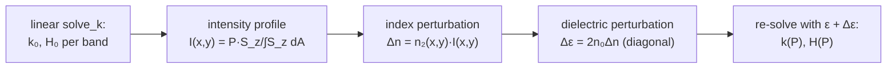

# ModeAnalysis — dispersion, mode character, and Kerr corrections

`ModeAnalysis` post-processes single mode solutions $(k, \vec H)$ from
[`solve_k`](maxwell_eigenmodes.md) into the quantities designers care about — group
index, group-velocity dispersion, effective area, polarization, mode order — and
implements first-order **Kerr (intensity-dependent index) corrections** to mode
solves. All of it is reverse-mode differentiable.

## Group index

The modal group index is the frequency derivative of the propagation constant,
$n_g = \partial k/\partial\omega$. Differentiating the eigenvalue relation
$\langle H|\hat M(k,\omega)|H\rangle = \omega^2$ at fixed eigenvector
(Hellmann–Feynman) gives a closed-form expression evaluated from a *single* mode
solution — no finite differences, no extra solves:

$$
n_g \;=\; \frac{\partial k}{\partial \omega}
\;=\; \frac{2\omega - \big\langle H\big|\tfrac{\partial \hat M}{\partial\omega}\big|H\big\rangle}
        {\big\langle H \big| \tfrac{\partial \hat M}{\partial k} \big| H \big\rangle}
\;=\; \frac{\omega + \tfrac12\langle H|\hat M[\,\varepsilon^{-1}(\partial_\omega\varepsilon)\varepsilon^{-1}\,]|H\rangle}
        {\tfrac12\langle H|\hat M_k|H\rangle},
$$

where the numerator's second term accounts for **material dispersion** through the
smoothed $\partial\varepsilon/\partial\omega$ field
(`group_index(k, evec, ω, ε⁻¹, ∂ε_∂ω, grid)`; the quadratic forms are `HMH` and
`HMₖH`).

## Group-velocity dispersion

The GVD, $\partial n_g/\partial\omega = \partial^2 k/\partial\omega^2$, requires the
*derivative of the eigenvector*, which `ng_gvd`/`ng_gvd_E` obtain by solving one
**adjoint linear system** per mode (same machinery as the `solve_k` pullback,
`eig_adjt`) instead of re-solving at neighboring frequencies. The result uses the
smoothed second-derivative field $\partial^2\varepsilon/\partial\omega^2$ produced by
[`smooth_ε`](dielectric_smoothing.md), and is validated in the test suites against
high-order finite differences of $n_g(\omega)$ through full re-solves.

## Mode character

- `E_relpower_xyz(ε, E)`: relative E-field power along x/y/z — distinguishes
  quasi-TE (`(0.95, 0.04, 0.01)`-like) from quasi-TM modes.
- `count_E_nodes(E, ε, pol_idx)`: counts sign changes of the dominant field component
  along x and y cuts → Hermite–Gauss-like mode order $(m, n)$.
- `mode_viable` / `mode_idx`: filter mode lists for a target polarization and order —
  robust mode tracking through crossings in parameter sweeps.
- `𝓐(n, ng, E)`: effective area from the energy-normalized field.

## Kerr nonlinearity: power-dependent modes

With per-material Kerr coefficients $n_2$ (μm²/W, from
`MaterialDispersion.kerr_n2`, mapped onto the grid by
`DielectricSmoothing.smooth_scalar`), `solve_k_kerr` computes first-order
power-corrected modes:



1. **Intensity.** The mode's longitudinal Poynting flux
   $S_z = \mathrm{Re}(\vec E \times \vec H^*)\cdot\hat z$ (`poynting_z`) is normalized
   to carry the specified total power $P$ (W):
   $I(x,y) = P\, S_z / \int S_z\, dA$, so $\int I\, dA = P$ (`mode_intensity`).
   Each band is corrected assuming the *full* power resides in that mode (no cross
   coupling).
2. **Perturbation.** $\Delta n = n_2 I$ and, to first order in $\Delta n/n_0$,
   $\Delta\varepsilon_{aa} = 2 n_0 \Delta n$ with $n_0 = \sqrt{\mathrm{tr}\,\varepsilon/3}$
   per pixel (`kerr_dielectric_perturbation`).
3. **Re-solve.** Band $b$ is re-solved with $\varepsilon + \Delta\varepsilon$; the
   power-dependent effective-index shift is
   $\Delta n_{\mathrm{eff}}(P) = (k_b(P) - k_b(0))/\omega$.

For a single mode this reproduces the textbook self-phase-modulation result

$$
\Delta n_{\mathrm{eff}} \;\approx\; \frac{n_2\,P}{A_{\mathrm{eff}}},
\qquad
A_{\mathrm{eff}} = \frac{\big(\int I\, dA\big)^2}{\int I^2\, dA},
\qquad
\gamma = \frac{2\pi\, n_2}{\lambda\, A_{\mathrm{eff}}},
$$

verified to a few percent for a Si₃N₄ waveguide in the test suite and in
[`examples/kerr_si3n4_waveguide.jl`](../examples/kerr_si3n4_waveguide.jl)
(γ ≈ 0.95 W⁻¹m⁻¹ for a 1.60 × 0.80 μm core at 1.55 μm, matching literature values).

## Usage

```julia
using DielectricSmoothing, MaxwellEigenmodes, ModeAnalysis

kmags, evecs = solve_k(ω, ε⁻¹, grid, KrylovKitEigsolve(); nev=2)
k, ev = kmags[1], evecs[1]

ng        = group_index(k, ev, ω, ε⁻¹, ∂ε_∂ω, grid)
ng2, gvd  = ng_gvd(ω, k, ev, ε⁻¹, ∂ε_∂ω, ∂²ε_∂ω², grid)
E         = E⃗(k, copy(ev), ε⁻¹, ∂ε_∂ω, grid; canonicalize=true, normalized=true)
pol       = E_relpower_xyz(ε, E)               # e.g. (0.96, 0.03, 0.01) → quasi-TE
Aeff      = 𝓐(k/ω, ng, E)

# Kerr: power-dependent solve (n2map from smooth_scalar, P in W)
res = solve_k_kerr(ω, 1.0, ε⁻¹, ∂ε_∂ω, n2map, grid, KrylovKitEigsolve(); nev=1)
Δneff = (res.kmags[1] - res.kmags_lin[1]) / ω

# everything is differentiable, e.g. dng/dω via AD (compare to gvd above):
using ModeAnalysis: Zygote
dng_dω = Zygote.gradient(om -> group_index(k, ev, om, ε⁻¹, ∂ε_∂ω, grid), ω)[1]
```

## Key API

| function | purpose |
|---|---|
| `group_index` | $n_g$ from one mode solution (Hellmann–Feynman) |
| `ng_gvd`, `ng_gvd_E` | $n_g$ + GVD via one adjoint solve (+ E-field) |
| `E_relpower_xyz`, `count_E_nodes`, `mode_viable`, `mode_idx` | polarization & mode-order classification |
| `𝓐` / `effective_area`, `Eperp_max` | effective area |
| `poynting_z`, `mode_intensity` | power-normalized intensity profiles |
| `kerr_dielectric_perturbation`, `solve_k_kerr` | first-order Kerr (n₂) corrections |
