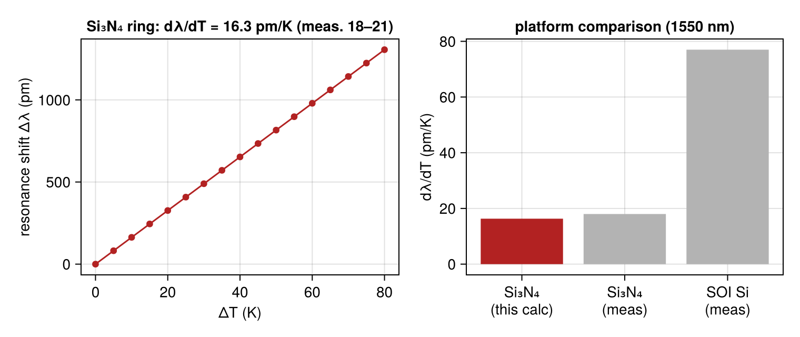
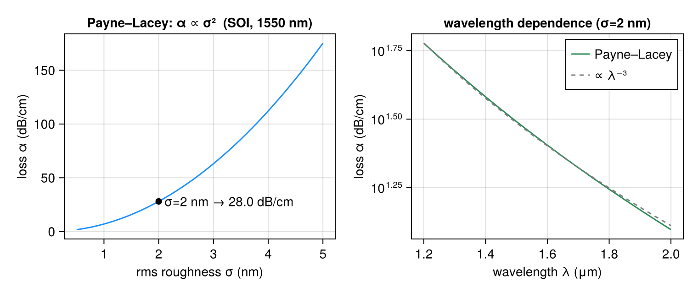
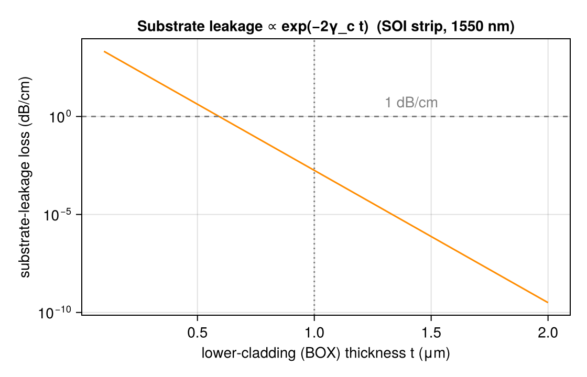
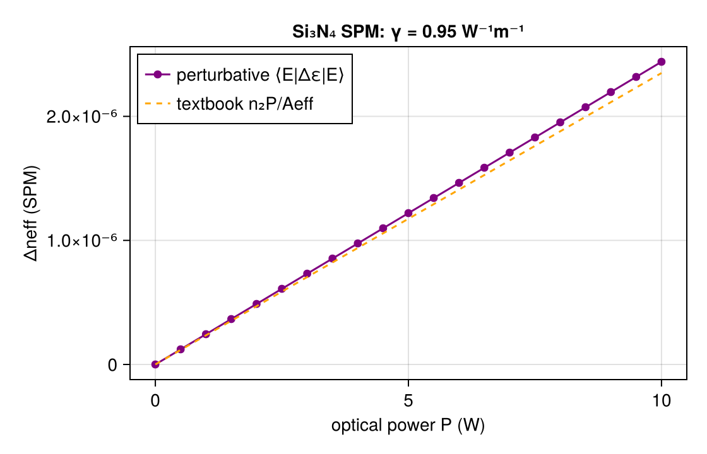
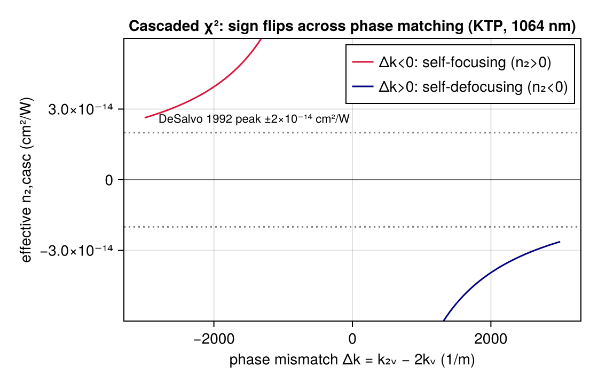
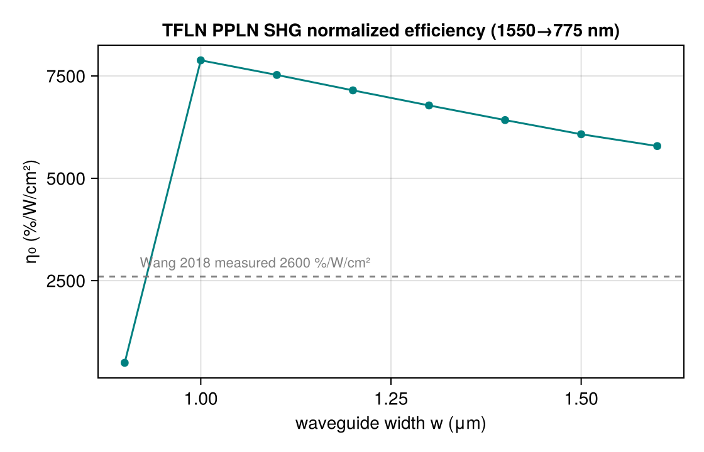
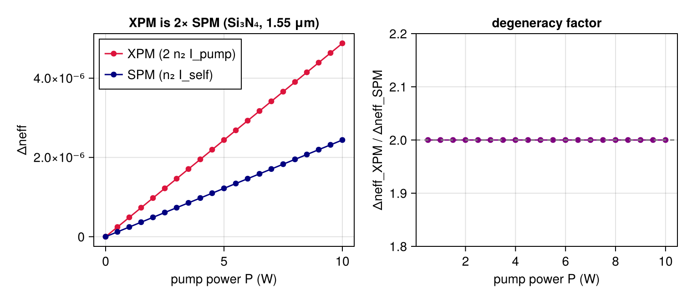
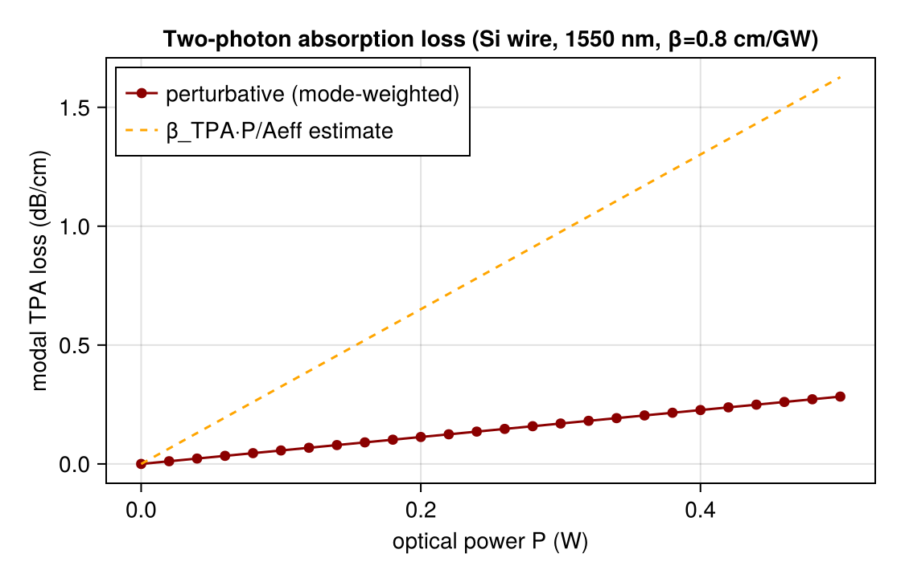
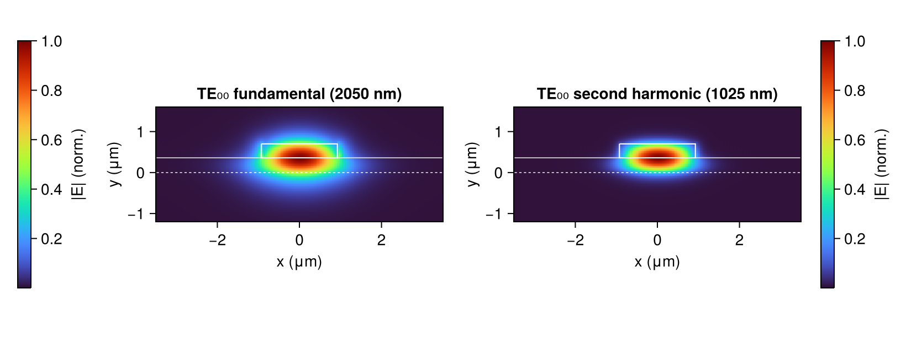
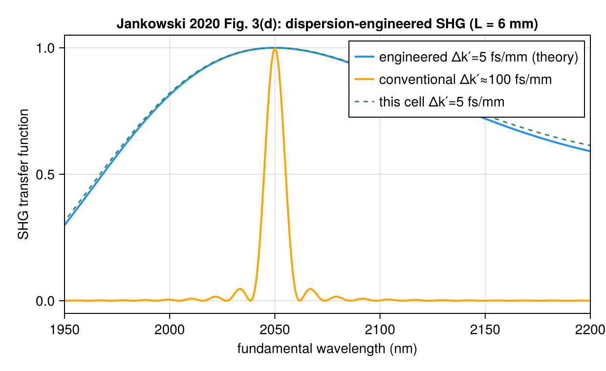

# ModePerturbations

First-order perturbation theory for guided-mode properties, built on the OptiMode
differentiable mode solver. Given one converged mode solution, `ModePerturbations`
computes the *weak* shifts of the modal effective index, group index, group-velocity
dispersion and linear/nonlinear loss caused by small perturbations — material, thermal,
roughness, substrate leakage, and χ⁽²⁾/χ⁽³⁾ nonlinearities — **without re-solving the
eigenproblem**, and every quantity is end-to-end automatic-differentiation compatible
(forward and reverse, ForwardDiff / Zygote / Enzyme / Mooncake) and validated against
finite differences.

## The core: frozen-mode (Hellmann–Feynman) perturbation

The plane-wave Helmholtz operator `M̂ = ∇× ε⁻¹ ∇×` has eigenpairs `(ω², ev)` at fixed
wavenumber `k`. A weak dielectric-tensor perturbation `Δε(x,y)` shifts the modal
wavenumber by the non-degenerate first-order amount

```math
Δk \;=\; \frac{⟨E|Δε|E⟩}{2⟨ev|∂M̂/∂k|ev⟩}
     \;=\; \frac{\mathrm{HMH}(ev,\,ε^{-1}Δε\,ε^{-1})}{2\,\mathrm{HM_kH}(ev,\,ε^{-1})},
```

where `⟨E|Δε|E⟩ = ∫ E^*·Δε·E\,dV` is assembled from the validated `MaxwellEigenmodes`
quadratic forms `HMH`/`HMₖH` (the same ones behind `group_index`). This is exactly the
frozen-mode sensitivity `∂k/∂p = ⟨E|∂ε/∂p|E⟩ / (2⟨ev|∂M̂/∂k|ev⟩)` that the umbrella
test-suite validates against finite differences — here packaged as a general engine and
generalized to **complex** `Δε`, so that absorptive/gain perturbations produce a complex
`Δk`:

| quantity | from `Δk` | function |
|---|---|---|
| effective-index shift | `Re(Δk)/ω` | `Δneff_perturbation` |
| modal power loss [1/μm] | `2 Im(Δk)` | `modal_loss_perturbation` |
| group-index / GVD shift | `d(Δk)/dω`, `d²(Δk)/dω²` | `perturbation_ng_gvd` |

```julia
using OptiMode, OptiMode.ModePerturbations
# (k0, ev0, ε⁻¹, ∂ωε, grid) from a normal solve_k + smoothing
Δε = Δε_from_Δn(Δn_map, ε)               # isotropic Δε = 2 n₀ Δn from a scalar index map
Δneff = Δneff_perturbation(k0, ev0, ω, ε⁻¹, Δε, grid)
```

`Δk = ⟨E|Δε|E⟩/(2⟨ev|∂M̂/∂k|ev⟩)` reproduces a full perturbed re-solve to ~1e-9 relative
error, and its gradients (forward and reverse) match finite differences to machine
precision — see `lib/ModePerturbations/test/runtests.jl`.

## Index perturbations: thermo-optic and user-specified Δn(x,y)

A temperature change shifts each material's index by `(dn/dT)·ΔT`; the smoothed map
`Δn(x,y) = (dn/dT)(x,y)·ΔT` becomes `Δε = 2 n₀ Δn` and feeds the core engine. A resonator
shifts by `Δλ/λ = Δneff/n_g`.

```julia
dndT_map = smooth_scalar(shapes, [2.45e-5, 0.95e-5], minds, grid)  # Si₃N₄ core / SiO₂ clad
dneff_dT = thermo_optic_dneff_dT(k0, ev0, ω, ε⁻¹, dndT_map, grid)
dλ_dT   = resonance_shift_dλ_dT(dneff_dT, ng, λ) * 1e6             # pm/K
```

This reproduces the measured Si₃N₄-microring thermo-optic sensitivity **dλ/dT ≈ 18 pm/K**
at 1550 nm (Arbabi & Goddard, *Opt. Lett.* **38**, 3878 (2013); Ilie et al., *Sci. Rep.*
**12**, 17815 (2022)). Any user index map — stress, doping, electro-optic — goes through
`index_perturbation_Δneff`. See [`examples/perturbation_thermo_optic.jl`](../examples/perturbation_thermo_optic.jl).



## Scattering loss

Radiative scattering is a coupling to a continuum, not a simple `Im(ε)`, so it gets
dedicated mode-field functionals.

**Surface/sidewall roughness (Payne–Lacey).** `payne_lacey_slab_loss` implements the
closed-form slab result `α = σ²/(√2 k₀d⁴n₁)·g(V)·f(x,γ)`; `roughness_scattering_loss` uses
the *actual* modal field at the etched interface (`sidewall_field_overlap`) for arbitrary
cross-sections. Loss scales as `σ²`, `(n₁²−n₂²)²` and `~λ⁻³`, in the dB/cm range of
as-fabricated SOI/SiN waveguides (Payne & Lacey, *Opt. Quantum Electron.* **26**, 977
(1994); Lee et al., *Opt. Lett.* **26**, 1888 (2001)). See
[`examples/perturbation_surface_roughness_loss.jl`](../examples/perturbation_surface_roughness_loss.jl).



**Substrate leakage.** `substrate_leakage_loss` gives `α = A·exp(−2γ_c t_clad)` with
`γ_c = k₀√(neff²−n_clad²)` — the buried-oxide design rule (Sridaran & Bhave, *Opt.
Express* **18**, 3850 (2010); Bauters et al., *Opt. Express* **19**, 3163 (2011)): thin BOX
→ >100 dB/cm, ≥1 μm BOX → <1 dB/cm. See
[`examples/perturbation_substrate_leakage.jl`](../examples/perturbation_substrate_leakage.jl).



## χ⁽³⁾ Kerr: SPM, XPM, two-photon absorption

The modal intensity `I(x,y)` at power `P` induces `Δn = n₂·I` (SPM) or `2 n₂·I_pump` (XPM),
fed to the core engine as a fast first-order alternative to a full `solve_k_kerr` re-solve;
two-photon absorption enters as an imaginary `Δn″ = β_TPA I λ/4π` giving a modal loss.

```julia
Aeff = effective_area_kerr(k0, ev0, ε⁻¹, grid)             # (∫I)²/∫I²  [μm²]
γ    = kerr_gamma(kerr_n2(Si₃N₄, λ), Aeff, λ)              # W⁻¹m⁻¹
Δneff = kerr_spm_Δneff(k0, ev0, ω, ε⁻¹, ∂ωε, n2_map, grid, P)
```

For a 1.60×0.80 μm Si₃N₄ core this gives **γ ≈ 0.95 W⁻¹m⁻¹** (Ikeda, *Opt. Express* **16**,
12987 (2008)) and `kerr_spm_Δneff` agrees with `solve_k_kerr` and the textbook `n₂P/Aeff`.
See [`examples/perturbation_kerr_spm.jl`](../examples/perturbation_kerr_spm.jl).



## Cascaded χ⁽²⁾ effective Kerr index

Phase-mismatched SHG induces an effective Kerr nonlinearity
`n₂,casc = −2ω₁d_eff²/(c²ε₀n₁²n₂Δk)` that changes sign across phase matching. This
reproduces DeSalvo et al. (*Opt. Lett.* **17**, 28 (1992)) in KTP at 1064 nm: self-focusing
for `Δk<0`, self-defocusing for `Δk>0`, `|n₂,eff| ≈ 2×10⁻¹⁴ cm²/W` near phase matching. See
[`examples/perturbation_cascaded_chi2.jl`](../examples/perturbation_cascaded_chi2.jl).



## χ⁽²⁾ SHG normalized efficiency (mode overlap)

`shg_normalized_efficiency` evaluates the nonlinear overlap integral of the fundamental and
second-harmonic modes (Luo et al., *Optica* **5**, 1006 (2018)),
`η₀ = 8π²ζ²d_eff²/(ε₀cλ²n₁²n₂A_eff)`, with `ζ` and `A_eff` from `shg_overlap_factor` /
`shg_effective_area`. For an x-cut TFLN waveguide (TE₀₀→TE₀₀ via `d₃₃`, `d_eff=(2/π)d₃₃`)
this reaches the few-thousand-%/W/cm² scale of nanophotonic PPLN waveguides (Wang et al.,
*Optica* **5**, 1438 (2018): 2600 %/W/cm² measured, ~5000 theory). See
[`examples/perturbation_shg_efficiency.jl`](../examples/perturbation_shg_efficiency.jl).



## χ⁽³⁾ XPM and two-photon absorption (standalone examples)

[`examples/perturbation_xpm.jl`](../examples/perturbation_xpm.jl) confirms cross-phase
modulation is exactly **twice** self-phase modulation at equal intensity (the χ⁽³⁾
degeneracy factor of 2, `Δn_XPM = 2 n₂ I_pump`); the computed ratio is 2.0000.
[`examples/perturbation_tpa_loss.jl`](../examples/perturbation_tpa_loss.jl) computes the
intensity-dependent two-photon-absorption modal loss of a 450×220 nm silicon wire
(β_TPA = 0.8 cm/GW), growing linearly with power into the dB/cm regime.




## Worked reproduction: dispersion-engineered PPLN (Jankowski et al., Optica 2020)

[`examples/tfln_ppln_jankowski2020.jl`](../examples/tfln_ppln_jankowski2020.jl) reproduces
the nanophotonic PPLN waveguide of *M. Jankowski et al., "Ultrabroadband nonlinear optics in
nanophotonic periodically poled lithium niobate waveguides," Optica 7, 40 (2020)* — an x-cut
TFLN ridge (1850 nm top width, 340 nm etch, 700 nm film) engineered for broadband SHG of
2050 → 1025 nm. Selecting the ridge-confined quasi-TE₀₀ mode (over the thick-slab
lateral-leakage modes) and computing the dispersion and χ²-overlap with the package
machinery reproduces the paper's design-point figures of merit:

| quantity | OptiMode | Jankowski 2020 |
|---|---|---|
| poling period Λ = λ/(2(n₂ω−nω)) | 4.99 μm | 5.11 μm |
| normalized efficiency η₀ | 1240 %/W·cm² | 1100 %/W·cm² |
| effective area A_eff | 1.36 μm² | 1.6 μm² |
| group-velocity mismatch Δk′ = (n_g,2ω−n_g,ω)/c | **+4.9 fs/mm** | **5 fs/mm** |
| GVD k″_ω | −12.4 fs²/mm | −15 fs²/mm |

The engineered group-velocity mismatch — the crux of the paper's dispersion engineering —
matches to <2%. The Fig. 1(a) modal fields and the Fig. 3(d) broadband SHG transfer
function `sinc²(Δk(Ω)L/2)` (dispersion-engineered vs conventional GVM-dominated) are
reproduced:




The Fig. 1(d,e) dispersion engineering is already visible across two computed geometries —
`Δk′` swings toward zero and `k″_ω` changes sign as the waveguide is widened/deepened:

| (top width, etch) | Λ | η₀ | Δk′ | k″_ω |
|---|---|---|---|---|
| (1800 nm, 320 nm) | 4.99 μm | 1229 %/W·cm² | +16 fs/mm | +15 fs²/mm |
| (1850 nm, 340 nm) | 4.99 μm | 1240 %/W·cm² | +4.9 fs/mm | −12.4 fs²/mm |

The *full* Fig. 1(b–e) maps of Λ, η₀, Δk′ and k″_ω over the whole (top width × etch depth)
plane deploy as a `ModeSweeps`/SLURM batch
([`tfln_ppln_geometry_sweep_setup.jl`](../examples/tfln_ppln_geometry_sweep_setup.jl) +
[`tfln_ppln_geometry_sweep_deploy.jl`](../examples/tfln_ppln_geometry_sweep_deploy.jl)):
each grid point is one well-converged, large-cell solve of the weakly-guided 2-µm
fundamental, so the dozens of solves needed for the fs/mm-resolved Δk′ = 0 contour are a
cluster-scale job — exactly what ModeSweeps deploys (one SLURM array task per geometry,
gathered into the maps).

## Automatic differentiation

Every quantity is differentiable in **forward and reverse mode**, validated against
`FiniteDifferences.jl` in `lib/ModePerturbations/test/runtests.jl`:

- **ForwardDiff** (forward) and **Zygote** (reverse) differentiate *all* quantities,
  including the mode-field functionals — the FFTs and the `HMₖH` adjoint quadratic form go
  through AbstractFFTs' ForwardDiff extension and the existing ChainRules `rrule`s. These
  are the validated forward/reverse paths (the same engines the rest of OptiMode uses for
  `group_index`/`solve_k`), e.g. `dΔneff/dΔn`, `dΔneff/dΔT`, `dα/dσ`, `dΔneff/dP` all match
  finite differences to ≈machine precision.
- The closed-form scalar quantities (`payne_lacey_slab_loss`, `substrate_leakage_loss`,
  `cascaded_chi2_n2_eff`, `kerr_gamma`, …) additionally differentiate **natively in Enzyme
  (forward & reverse) and Mooncake** with no custom rule.
- For the FFT-path mode functionals, the two real-valued kernels `_perturbation_re`/
  `_perturbation_im` carry a ChainRules `rrule` (Zygote-backed) and `frule`
  (ForwardDiff-backed, since Enzyme forward cannot create FFTW plans); the `Enzyme`
  (`@import_rrule`) and `Mooncake` (`@from_rrule`) package extensions import them following
  the same pattern as `ModeAnalysis.group_index` and `MaxwellEigenmodes.solve_k`. Enzyme/
  Mooncake coverage of this FFT path therefore tracks the rest of OptiMode and the installed
  Enzyme/Mooncake versions (see the umbrella README's "Known limitations"); where it is
  unavailable, ForwardDiff/Zygote provide the validated forward/reverse gradients. The rule
  imports are guarded so a backend-version mismatch degrades gracefully rather than breaking
  package load.
