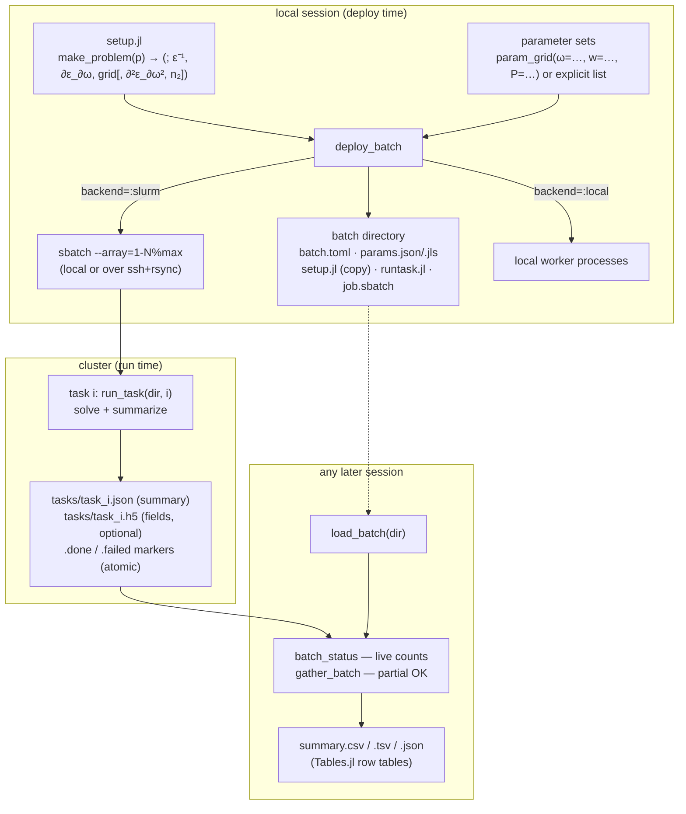
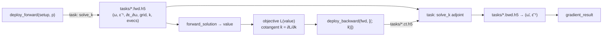

# ModeSweeps — asynchronous batched simulations

`ModeSweeps` turns parameter sweeps of mode simulations — frequency × geometry ×
material × power — into **batches** that run asynchronously as SLURM array jobs on a
cluster (or local processes for testing), with persistent state, live status, partial
gathering, and tabular results.

## Architecture



Key design points:

- **Self-contained batches.** Everything needed to monitor and gather a batch is
  written at deploy time, so `load_batch(dir)` works in a fresh Julia session, days
  later, on a different machine (ssh mode transfers markers/summaries with rsync).
- **Atomic, per-task results.** Workers write `task_NNNNNN.json` + `.done`/`.failed`
  markers atomically; `batch_status` and `gather_batch(partial=true)` are therefore
  race-free at any time during execution, and failures carry their error text.
- **One worker per parameter set** via SLURM array tasks
  (`#SBATCH --array=1-N%max_concurrent`), the scheduler-friendly way to run thousands
  of independent simulations.

## Per-task summaries

Each task × band row contains the swept parameters plus quantities **computed on the
remote worker** from the mode solution:

| group | columns |
|---|---|
| dispersion | `kmag`, `neff` (effective index), `ng` (group index), `gvd` |
| field | `Aeff` (effective area), `pol_x`/`pol_y`/`pol_z` (+ dominant `pol_axis`) |
| mode character | `label` (e.g. `TE₀₀`), `mode_pol` (`TE`/`TM`), `mode_m`, `mode_n`, `hg_rel_error` (fit goodness), `te_frac` |
| Kerr | `dneff_kerr`, `dn_max` (zero for linear solves) |
| execution | `host`, `runtime_s`, `started`, `finished`, `slurm_job`, `slurm_task` |

The mode-character columns come from a threshold-free Hermite–Gaussian fit
([`hg_mode_label`](mode_analysis.md)); set `mode_labels=false` to skip the fit. This
lightweight, tabular summary is produced for **every** batch — the full field data
(eigenvectors + E-fields, HDF5) is stored *additionally* only when deployed with
`save_fields=true`, and loaded per task with `load_fields`.

## Annotated mode-field images (PNG)

With `save_plots=true`, every worker renders one PNG per band — false-colour
`|Eₓ|`,`|E_y|`,`|E_z|` panels topped by a header carrying that band's summary
(`neff`, `ng`, GVD, `Aeff`, polarization, mode label, host, run time) — into the batch's
`tasks/` directory, and (in ssh mode) transfers them back with the summaries. The
renderer is **dependency-free** (a small pure-Julia PNG encoder, viridis colormap and
bitmap font), so PNGs are produced on any SLURM node with no plotting stack or display,
identically whether the batch keeps full fields or summaries only:

```julia
batch = frequency_sweep("ridge_wg_setup.jl"; ω=0.55:0.01:0.75, nev=3, save_plots=true,
                        slurm=SlurmConfig(ssh="me@cluster", remote_dir="/scratch/me/sw1"))
wait_batch(batch)                  # block until done (synchronous deployment)
gather_batch(batch)                # also fetches the PNGs (fetch_plots=true by default)
plot_paths(batch, 7)               # ["…/task_000007_b01.png", "…_b02.png", "…_b03.png"]
```

Load the full field data (`load_fields`) into a local Makie/Plots session for
publication-quality figures; these PNGs are for at-a-glance inspection of a whole sweep.

## Blocking vs. asynchronous deployment

`deploy_batch`/`frequency_sweep` are **asynchronous** by default: they submit and return
a `BatchInfo` immediately, and you monitor/gather later (from any session). For a
**blocking** (synchronous) call, pass `blocking=true` (it waits until every task has
finished before returning) or call `wait_batch` yourself:

```julia
batch = frequency_sweep("setup.jl"; ω=ωs, blocking=true)   # returns when complete
rows  = gather_batch(batch)

# or reconnect to a long-running batch from another machine and block on it:
wait_batch(load_batch("/scratch/me/sw1"); poll=30)
```

## Remote automatic differentiation (adjoint on the cluster)

The eigensolve `solve_k` carries an adjoint-method `rrule` (see
[automatic_differentiation.md](automatic_differentiation.md)): given output cotangents
it returns input cotangents `(ω̄, ε̄⁻¹)` for ≈ one extra eigensolve. ModeSweeps deploys
the **forward (primal)** and **backward (adjoint)** passes as *separate SLURM tasks* that
exchange state through the cluster's shared filesystem — so the forward and backward
solves of an adjoint inverse-design loop can run on different nodes, at different times,
even driven from different machines:



```julia
p   = (; ω = 1/1.55, w_top = 1.7)

# forward pass (its own SLURM task) — primal solution + adjoint inputs on shared FS
fwd = deploy_forward("ridge_wg_setup.jl", [p]; nev=1, blocking=true,
                     slurm=SlurmConfig(ssh="me@cluster", remote_dir="/scratch/me/fwd"))
sol = forward_solution(fwd)                  # (; ω, kmags, evecs, ε⁻¹, ∂ε_∂ω, grid)
neff = sol.kmags[1] / sol.ω                  # the value we differentiate

# backward pass (a separate SLURM task) — cotangent k̄ = ∂L/∂kmag for L = neff
bwd = deploy_backward(fwd, [(; k̄ = [1/sol.ω])]; blocking=true,
                     slurm=SlurmConfig(ssh="me@cluster", remote_dir="/scratch/me/bwd"))
g   = gradient_result(bwd)                   # (; ω_bar, ε⁻¹_bar) = ∂neff/∂(ω, ε⁻¹)

# …or both passes in one blocking call:
r = remote_value_and_gradient("ridge_wg_setup.jl", p, [1/p.ω]; nev=1,
                              slurm=SlurmConfig(ssh="me@cluster", remote_dir="/scratch/me/ad"))
```

`ε⁻¹_bar` (the sensitivity to every dielectric-tensor entry at every pixel) chains with
the forward-mode geometry/material Jacobian `∂ε⁻¹/∂p` to give exact geometry/material
gradients — the standard adjoint pattern for waveguide inverse design, now with the
expensive solves offloaded to SLURM (see
[`examples/remote_adjoint_optimization.jl`](../examples/remote_adjoint_optimization.jl)).
The `k̄`-cotangent path (objectives built from `neff`/`ng`/GVD/`Aeff`, i.e. functions of
`kmag`) is exact; eigenvector (`ēv`) cotangents are phase-sensitive and best expressed
through the field post-processing adjoints.

## Kerr power sweeps

If `make_problem` returns an `n₂` map (μm²/W), any parameter set containing an optical
power `P` (W) is solved with the first-order power correction
([`solve_k_kerr`](mode_analysis.md#kerr-nonlinearity-power-dependent-modes)) — power
sweeps deploy exactly like any other parameter
(see [`examples/kerr_power_sweep_setup.jl`](../examples/kerr_power_sweep_setup.jl)).

## Usage

```julia
using ModeSweeps

# 1. a setup script defining make_problem(p::NamedTuple); p.ω is the frequency
# 2. deploy a frequency × geometry sweep as one SLURM array job
batch = frequency_sweep("ridge_wg_setup.jl";
    ω = 0.55:0.005:0.75, w_top = [1.4, 1.7, 2.0], nev = 2,
    solver = "KrylovKitEigsolve()",
    slurm  = SlurmConfig(time="0:30:00", partition="general", max_concurrent=50))

# … equivalently with explicit parameter sets / Cartesian grids:
batch = deploy_batch("ridge_wg_setup.jl", param_grid(ω=ωs, w_top=ws); nev=2)

# 3. anytime, in any session:
batch = load_batch("modesweeps_freq_sweep")
batch_status(batch)                       # done/failed/pending (+ squeue info)
rows  = gather_batch(batch)               # partial results OK while running;
                                          # writes summary.{csv,tsv,json}
rows  = load_summary("…/summary.csv")     # reload for analysis (DataFrame(rows) works)
fd    = load_fields(batch, 7)             # full fields of task 7 (save_fields=true)
```

Backends: `backend=:slurm` (default; local `sbatch` or
`SlurmConfig(ssh="user@cluster", remote_dir=…)`), `:local` (background processes),
`:none` (dry run — inspect/submit `job.sbatch` manually).

## Key API

| function | purpose |
|---|---|
| `param_grid` | Cartesian parameter grids (first keyword varies fastest) |
| `SlurmConfig` | time/partition/memory/concurrency/ssh options |
| `deploy_batch`, `frequency_sweep` | create + submit batches (`blocking=true` for synchronous) |
| `load_batch`, `batch_status`, `cancel_batch`, `wait_batch` | persistence & monitoring |
| `gather_batch`, `save_summary`, `load_summary` | tabular results |
| `load_fields`, `plot_paths` | full mode fields / annotated PNGs per task |
| `deploy_forward`, `forward_solution` | remote AD forward pass (primal + adjoint inputs) |
| `deploy_backward`, `gradient_result`, `remote_value_and_gradient` | remote AD adjoint pass |
| `render_mode_png`, `write_png` | dependency-free field-image rendering |
| `run_task` | worker entry point (called by generated `runtask.jl`) |

Deployment options worth knowing: `save_fields` (full HDF5 fields), `save_plots`
(annotated PNGs), `mode_labels`/`label_max_order` (HG mode classification), `blocking`
(synchronous), `nev`, `solver`/`solver_kwargs`, `backend`, `slurm`.
