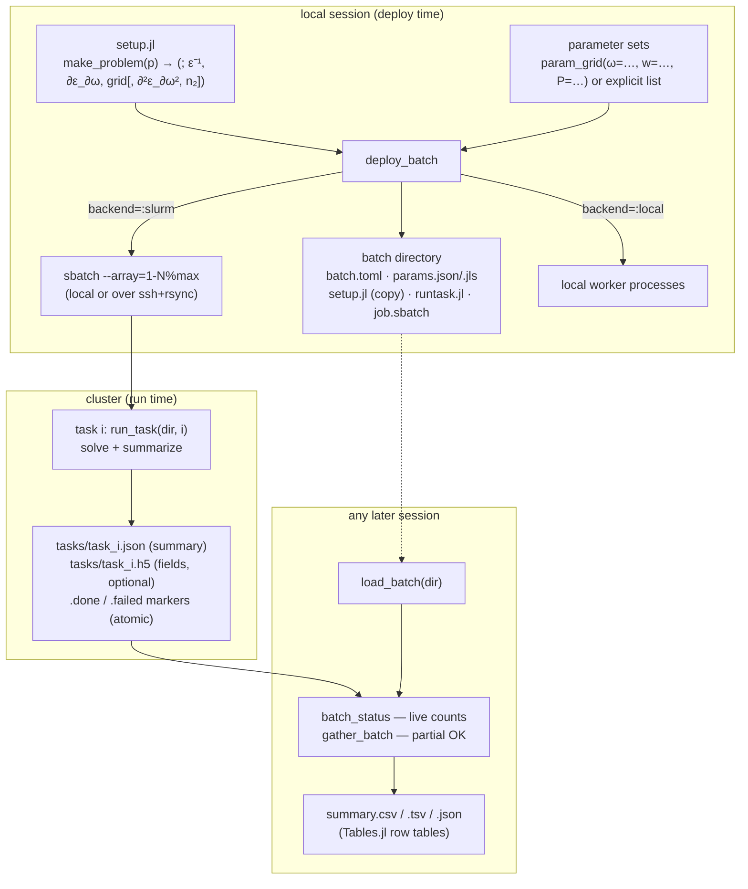

# ModeSweeps — asynchronous batched simulations

`ModeSweeps` turns parameter sweeps of mode simulations — frequency × geometry ×
material × power — into **batches** that run asynchronously as SLURM array jobs on a
cluster (or local processes for testing), with persistent state, live status, partial
gathering, and tabular results.

## Architecture



Key design points:

- **Self-contained batches.** Everything needed to monitor and gather a batch is
  written at deploy time, so `load_batch(dir)` works in a fresh Julia session, days
  later, on a different machine (ssh mode transfers markers/summaries with rsync).
- **Atomic, per-task results.** Workers write `task_NNNNNN.json` + `.done`/`.failed`
  markers atomically; `batch_status` and `gather_batch(partial=true)` are therefore
  race-free at any time during execution, and failures carry their error text.
- **One worker per parameter set** via SLURM array tasks
  (`#SBATCH --array=1-N%max_concurrent`), the scheduler-friendly way to run thousands
  of independent simulations.

## Per-task summaries

Each task × band row contains: the swept parameters, `kmag`, `neff`, `ng` (group
index), `gvd`, `Aeff`, polarization fractions `pol_x/pol_y/pol_z` (+ dominant
`pol_axis`), and the Kerr columns `dneff_kerr`, `dn_max` (zero for linear solves).
Full field data (eigenvectors + E-fields, HDF5) is stored when deployed with
`save_fields=true` and loaded per task with `load_fields`.

## Kerr power sweeps

If `make_problem` returns an `n₂` map (μm²/W), any parameter set containing an optical
power `P` (W) is solved with the first-order power correction
([`solve_k_kerr`](mode_analysis.md#kerr-nonlinearity-power-dependent-modes)) — power
sweeps deploy exactly like any other parameter
(see [`examples/kerr_power_sweep_setup.jl`](../examples/kerr_power_sweep_setup.jl)).

## Usage

```julia
using ModeSweeps

# 1. a setup script defining make_problem(p::NamedTuple); p.ω is the frequency
# 2. deploy a frequency × geometry sweep as one SLURM array job
batch = frequency_sweep("ridge_wg_setup.jl";
    ω = 0.55:0.005:0.75, w_top = [1.4, 1.7, 2.0], nev = 2,
    solver = "KrylovKitEigsolve()",
    slurm  = SlurmConfig(time="0:30:00", partition="general", max_concurrent=50))

# … equivalently with explicit parameter sets / Cartesian grids:
batch = deploy_batch("ridge_wg_setup.jl", param_grid(ω=ωs, w_top=ws); nev=2)

# 3. anytime, in any session:
batch = load_batch("modesweeps_freq_sweep")
batch_status(batch)                       # done/failed/pending (+ squeue info)
rows  = gather_batch(batch)               # partial results OK while running;
                                          # writes summary.{csv,tsv,json}
rows  = load_summary("…/summary.csv")     # reload for analysis (DataFrame(rows) works)
fd    = load_fields(batch, 7)             # full fields of task 7 (save_fields=true)
```

Backends: `backend=:slurm` (default; local `sbatch` or
`SlurmConfig(ssh="user@cluster", remote_dir=…)`), `:local` (background processes),
`:none` (dry run — inspect/submit `job.sbatch` manually).

## Key API

| function | purpose |
|---|---|
| `param_grid` | Cartesian parameter grids (first keyword varies fastest) |
| `SlurmConfig` | time/partition/memory/concurrency/ssh options |
| `deploy_batch`, `frequency_sweep` | create + submit batches |
| `load_batch`, `batch_status`, `cancel_batch` | persistence & monitoring |
| `gather_batch`, `save_summary`, `load_summary`, `load_fields` | results |
| `run_task` | worker entry point (called by generated `runtask.jl`) |
